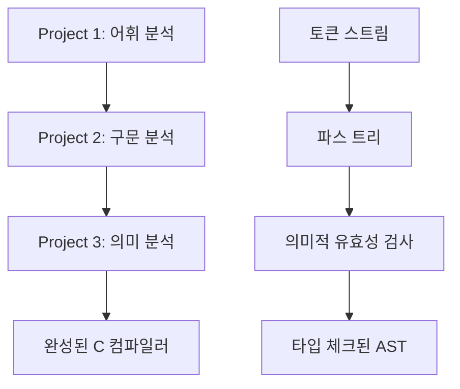
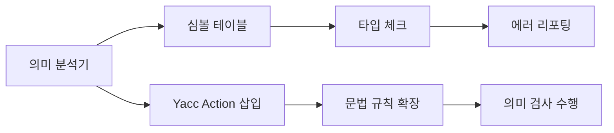
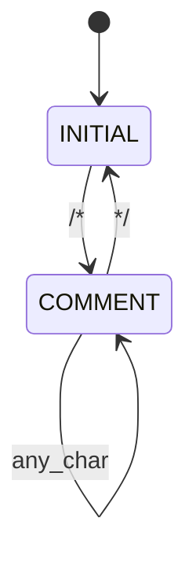
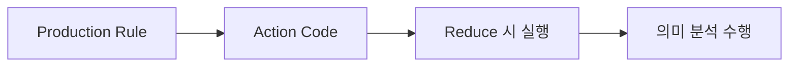
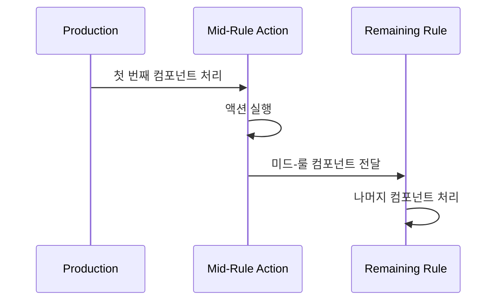

# 📚 Project 3: Semantic Analysis 요구사항 명세서

> 🎯 **목적**: C 컴파일러 구현 프로젝트의 의미 분석 단계를 위한 종합 가이드

## 📋 목차

- [📋 목차](#-목차)
- [🔍 1. 프로젝트 개요](#-1-프로젝트-개요)
- [⚙️ 2. 구현 핵심 요소](#️-2-구현-핵심-요소)
- [🔤 3. 어휘 분석기 (Lex - `subc.l`) 관련 요구사항](#-3-어휘-분석기-lex---subcl-관련-요구사항)
- [📝 4. 구문 분석기 (Yacc - `subc.y`) 관련 요구사항](#-4-구문-분석기-yacc---subcy-관련-요구사항)
- [✅ 5. 의미 분석 체크리스트](#-5-의미-분석-체크리스트)
- [🗃️ 6. 심볼 테이블 및 타입 관리](#️-6-심볼-테이블-및-타입-관리)
- [📖 7. 문법 특징](#-7-문법-특징)
- [❌ 8. 고려하지 않는 사항](#-8-고려하지-않는-사항)
- [🔍 9. 메모리 오류 체크](#-9-메모리-오류-체크)
- [📤 10. 출력 요구사항](#-10-출력-요구사항)
- [💡 11. 구현 팁](#-11-구현-팁)
- [📊 12. 프로젝트 진행 상황 체크리스트](#-12-프로젝트-진행-상황-체크리스트)

---

## 🔍 1. 프로젝트 개요

## 🔍 1. 프로젝트 개요



Project 3는 간단한 C 컴파일러 구현 프로젝트의 **최종 단계**로, **의미 분석(Semantic Analysis)**을 담당합니다. 

이전 단계인 Project 1 (어휘 분석)과 Project 2 (구문 분석)를 거쳐 생성된 토큰과 파스 트리를 기반으로, 입력 C 코드가 "의미"에 맞는지 검사하는 것이 주된 목적입니다.

### 🎯 주요 목표

| 목표 | 설명 |
|------|------|
| **의미적 유효성 검증** | Input C 코드의 의미적 유효성을 검증합니다 |
| **타입 체크** | 변수, 함수, 연산자의 타입 호환성을 검사합니다 |
| **선언 검증** | 선언되지 않은 변수/함수 사용을 탐지합니다 |
| **스코프 관리** | 변수의 스코프 범위를 올바르게 관리합니다 |

---

## ⚙️ 2. 구현 핵심 요소

## ⚙️ 2. 구현 핵심 요소



### 🔧 핵심 구성 요소

| 구성 요소 | 설명 | 우선순위 |
|-----------|------|----------|
| **의미 분석기 구현** | 실제 의미 분석 기능을 구현합니다 | 🔴 필수 |
| **심볼 테이블 구현** | 각 변수에 대한 정보(이름, 타입, 스코프)를 저장합니다 | 🔴 필수 |
| **Yacc Action 삽입** | `subc.y` 문법의 적절한 위치에 C 코드를 삽입합니다 | 🔴 필수 |
| **에러 메시지 출력** | 에러 발견 시 적절한 메시지를 출력합니다 | 🔴 필수 |

---

## 🔤 3. 어휘 분석기 (Lex - `subc.l`) 관련 요구사항

## 🔤 3. 어휘 분석기 (Lex - `subc.l`) 관련 요구사항

### 💬 주석(Comment) 지원



#### ✅ 구현 요구사항

| 항목 | 상세 내용 |
|------|-----------|
| **지원 형태** | `/* */` 형태의 주석만 지원 |
| **중첩 주석** | 고려하지 않음 (단순 구현) |
| **모드 활용** | `INITIAL`과 `COMMENT` 모드 사용 |

#### 🔧 구현 방법

```c
%x COMMENT

%%
"/*"            { BEGIN(COMMENT); }
<COMMENT>"*/"   { BEGIN(INITIAL); }
<COMMENT>.      { /* 주석 내용 무시 */ }
<COMMENT>\n     { /* 라인 번호 증가 처리 */ }
```

### 📍 라인 번호(Line Number) 관리

- **기능**: `get_lineno()` 함수로 현재 라인 번호 추적
- **자동 증가**: newline(`\n`) 스캔 시 자동으로 라인 번호 증가
- **상태**: skeleton code에 이미 구현되어 있음

### 📁 파일 이름(File Name) 전달

#### 🎯 목적
의미 에러 메시지 출력 시 파일 이름과 라인 번호를 함께 표시

#### 💾 구현 방법
```c
// 전역 변수 선언
char* filename;

// main 함수에서 파일 이름 복사
int main(int argc, char* argv[]) {
    if (argc > 1) {
        filename = (char*)malloc(strlen(argv[1]) + 1);
        strcpy(filename, argv[1]);
    }
    // ... 나머지 구현
}
```

### ⚠️ 문자열 연산 주의사항

| 함수 | 동작 | null 문자 포함 여부 |
|------|------|-------------------|
| `strcpy` | 문자열 복사 | ✅ 포함 |
| `strcmp` | 문자열 비교 | ✅ 포함 |
| `strlen` | 문자열 길이 | ❌ 제외 |

### 🔍 Lexeme 정보 활용

#### 중요 변수들

| 변수 | 타입 | 설명 | 주의사항 |
|------|------|------|----------|
| `yytext` | `char*` | 현재 매치된 lexeme 문자열 | 값이 덮어쓰기됨 |
| `yyleng` | `int` | lexeme 문자열 길이 (null 제외) | 값이 덮어쓰기됨 |

> ⚠️ **중요**: `yytext`와 `yyleng`는 각 토큰 인식 시마다 값이 덮어쓰이므로, lexeme 문자열을 **복사하여 저장**해야 합니다.

```c
// 올바른 사용 예시
char* saved_text = (char*)malloc(yyleng + 1);
strcpy(saved_text, yytext);
```

---

## 📝 4. 구문 분석기 (Yacc - `subc.y`) 관련 요구사항

## 📝 4. 구문 분석기 (Yacc - `subc.y`) 관련 요구사항

### 🔧 기본 개념

#### `%empty` 기호
- **용도**: ε (empty string)을 명시적으로 표현
- **문법**: 빈 production 규칙에서 사용

#### 액션(Action)


- **정의**: C 코드를 문법 production의 RHS(오른쪽)에 삽입
- **실행 시점**: 해당 production 파싱 중 (주로 reduce 시)

### 🔢 액션 변수(Action Variable)

| 변수 | 설명 | 예시 |
|------|------|------|
| `$i` | i번째 심볼의 값 | `$1`, `$2`, `$3` |
| `$$` | 현재 production LHS 심볼 값 | 결과 값 할당 |

#### 사용 예시
```c
expr : expr '+' term { $$ = $1 + $3; }  // $1: expr, $3: term
```

### 🔄 `yylval` 변수

#### 기본 개념
- **목적**: Lexer에서 Parser로 토큰 값 전달
- **기본 타입**: `int`

#### `%union` 활용
```c
%union { 
    int ival; 
    char* sval;
    TypeInfo* typeInfo;
}

%token <ival> NUM
%token <sval> ID
%token <typeInfo> TYPE
```

### ⚡ 미드-룰 액션(Mid-Rule Action)



#### ⚠️ 주의사항

| 항목 | 제한사항 |
|------|----------|
| **접근 범위** | 바로 이전 컴포넌트(`$i`)만 접근 가능 |
| **충돌 가능성** | shift/reduce 충돌 발생 가능 |
| **해결책** | 첫 번째 비터미널/터미널 이후 삽입 권장 |

#### 구현 예시
```c
stmt : IF '(' { /* 조건 체크 시작 */ } expr ')' stmt
     | WHILE '(' { /* 루프 시작 */ } expr ')' stmt
```

---

## ✅ 5. 의미 분석 체크리스트

Project 3에서 구현해야 할 의미 분석 체크 항목은 다음과 같습니다:

*   **선언되지 않은 변수 및 함수 (Undeclared Variables & Functions)**:
    *   선언되지 않은 변수 사용 (e.g., `a = 0;` 이전에 `a`가 선언되지 않은 경우).
    *   스코프를 벗어난 변수 사용 (e.g., `{ int a; } a = 0;` 블록 밖에서 `a` 사용).
    *   정의되지 않은 함수 호출 (e.g., `foo();` 이전에 `foo`가 정의되지 않은 경우).
*   **재선언 (Re-declaration)**:
    *   동일한 이름의 변수, 구조체, 함수가 동일한 스코프 내에서 재선언되는 경우 에러를 발생시킵니다.
    *   **구현 편의상**: 변수, 구조체, 함수 등 서로 다른 종류끼리 이름이 겹치는 경우는 고려하지 않습니다 (e.g., `int foo; int foo(int x, int y) {}`는 에러로 처리하지 않음).
*   **타입 체크 (Type Checking)**:
    *   **할당(Assignment)**:
        1.  LHS(왼쪽 피연산자)가 **Lvalue**인지 체크합니다. (상수(`5 = a;`)나 배열 이름(`b = &a;`)에는 값 할당 불가능).
        2.  RHS(오른쪽 피연산자)가 `NULL`이고 LHS가 포인터 타입인지 체크합니다.
        3.  LHS와 RHS의 타입이 같은지 체크합니다.
            *   **암묵적 형변환은 허용되지 않습니다** (e.g., `char a = 1;`은 에러, `int a; char b; a = b;`는 에러).
            *   포인터와 배열 간의 할당 (`int *a; int b; a = b;`)은 `TypeInfo`가 다르므로 에러로 처리합니다.
            *   구조체의 경우, 구조가 동일하더라도 다른 이름으로 선언되어 있으면 다른 타입으로 처리합니다.
    *   **이항 연산(Binary Operation) (`+`, `-`, `*`, `/`, `%`)**:
        *   Integer 타입에만 허용됩니다. 그 외 타입은 에러입니다.
    *   **논리 연산(Logical Operation) (`&&`, `||`)**:
        *   Integer 타입에만 허용됩니다. 그 외 타입은 에러입니다.
    *   **관계 연산(Relational Operation) (`>=`, `>`, `<=`, `<`)**:
        *   `int`, `char` 타입에만 허용됩니다. 그 외 타입은 에러입니다.
        *   연산 결과는 `int` 타입으로 처리됩니다.
    *   **등가 연산(Equop) (`==`, `!=`)**:
        *   `int`, `char`, `pointer` 타입에만 허용됩니다. 그 외 타입은 에러입니다.
        *   연산 결과는 `int` 타입으로 처리됩니다.
    *   **단항 연산(Unary Operation) (`-`, `!`)**:
        *   Integer 타입에만 허용됩니다. 그 외 타입은 에러입니다.
    *   **증감 연산(Increment/Decrement) (`++`, `--`)**:
        *   `int`, `char` 타입에만 허용됩니다. 그 외 타입은 에러입니다.
    *   **포인터 연산자(Pointer Operator) (`*`, `&`)**:
        *   `*` (역참조): 오른쪽(RHS)에는 `pointer` 타입만 가능합니다.
        *   `&` (주소 연산): 오른쪽(RHS)에는 `rvalue`만 가능하나, 구현 편의상 number, array, string과 같은 non-lvalue는 불가능합니다.
        *   `NULL`: `0`은 `NULL`로 사용될 수 없으며, `NULL`은 `pointer` 타입에만 할당 가능합니다.
    *   **구조체 연산자(Struct Operator) (`.`, `->`)**:
        *   `.`: 왼쪽(LHS)에는 `struct` 타입만 가능합니다.
        *   `->`: 왼쪽(LHS)에는 `struct pointer` 타입만 가능합니다.
        *   `.` 또는 `->` 오른쪽의 identifier는 해당 구조체의 필드 이름만 가능합니다.
    *   **배열 연산자(Array Operator) (`[]`)**:
        *   `a[i]`에서 `a`는 `array` 타입만 가능하고, `i`는 `int` 타입만 가능합니다.
*   **구조체 및 구조체 포인터 선언 (Structure & Structure pointer declaration)**:
    *   **구조체**: Struct 타입은 struct instance(사용) 전에 정의되어야 합니다.
    *   **구현 편의상**: Struct는 항상 **글로벌 선언(global declaration)**으로 처리됩니다 (스코프는 struct에 적용되지 않음).
    *   **구조체 포인터**: Struct pointer 선언 시 글로벌 타입 리스트를 탐색하여 해당 struct를 찾습니다. 글로벌 타입 리스트에 없는 경우 오류를 발생시킵니다.
*   **함수 선언 (Function Declaration)**:
    *   **리턴 타입 체크**: 함수의 리턴 타입이 일치하는지 확인합니다.
    *   **함수 호출 인자 타입 비교**: 함수 호출 시 인자의 타입과 함수 정의의 파라미터 타입이 일치하는지 비교합니다.
    *   **함수 호출 후 리턴 값 타입 체크**: 함수 호출 후 리턴 값의 타입과 할당하려는 변수의 타입이 일치하는지 확인합니다.
    *   **선언되지 않은 함수 호출 에러**: 함수가 아닌 것을 함수처럼 호출하거나 선언되지 않은 함수를 호출하는 경우 에러를 발생시킵니다.

#### **6. 심볼 테이블 및 타입 관리 상세**

*   **스코프 기반 심볼 테이블 (Scoped Symbol Table)**:
    *   C 언어는 스코프 기반 변수 선언 및 할당을 지원하며, 스코프별로 동일한 이름의 변수를 각각 선언하고 사용할 수 있습니다.
    *   각 변수는 가장 가까운 스코프의 선언을 따릅니다.
    *   **구현**: **심볼 테이블의 스택(Stack of symbol tables)** 형태로 구현하는 것을 권장합니다. 각 스코프별로 하나의 심볼 테이블을 가지는 형태입니다.
        *   새로운 스코프를 만나면 심볼 테이블을 생성하고 스택에 추가합니다.
        *   스코프가 끝나면 스택 top에 있는 심볼 테이블을 제거(pop)합니다.
        *   변수 정보를 찾을 때는 스택 top부터 차례대로 탐색합니다.
        *   **구현의 편의를 위해 Linked List 형태로 구현하는 것을 추천합니다** (자유롭게 구현 가능).
        *   파싱 중에 액션 코드에서 심볼 테이블을 생성하고, 각 변수의 이름, 타입 등의 정보를 저장합니다.
        *   저장된 심볼 테이블을 토대로 의미 분석 체크를 수행합니다.
*   **복합 타입(`TypeInfo` 구조체) 처리**:
    *   **포인터 처리**: 포인터의 경우 `pointer type`에 대한 정보(e.g., `int* x`에서 `pointer_type`이 `int`임을 저장)를 추가로 저장해야 합니다.
    *   **배열 처리**: 배열의 경우 `array type`에 대한 정보(e.g., `int x`에서 `array_type`이 `int`임을 저장)를 추가로 저장해야 합니다.
    *   **포인터에 대한 배열 등 복합 타입**: `int* x`과 같이 복잡한 타입은 심볼 테이블 노드에 필드를 계속 추가하면 복잡하고 비효율적입니다.
    *   **`TypeInfo` 구조체 활용**: **타입 정보를 가진 별도의 구조체(`TypeInfo`)**로 관리하고, 이를 **`TypeInfo`의 Linked List 형태로 연결**하여 복합 타입을 표현합니다.
*   **심볼 추가 및 스코프 관리 액션**:
    *   **심볼 추가**: 변수 선언 production(e.g., `def : type_specifier pointers ID ';'`)의 액션 코드에 심볼을 추가하는 코드를 삽입합니다.
        *   ID 토큰의 값(문자열)은 Lex에서 `yylval`을 통해 전달받습니다.
        *   액션 코드에서 `$3`을 통해 ID 값을 얻고, 이를 심볼 테이블에 타입 정보와 함께 추가합니다.
        *   `type_specifier` production의 액션 코드에서 `$$` 값에 타입 정보를 할당해야 합니다.
    *   **새로운 스코프 추가/제거**: 새로운 스코프(block)를 만나면 스코프 스택에 스코프를 추가합니다.
        *   예: `compound_stmt : '{' {scope 추가 액션} def_list stmt_list '}' {scope 제거 액션} ;`.
        *   이는 힌트이며, 실제 구현 시 함수 선언 처리를 위해 다르게 구현해야 할 수도 있습니다.
*   **구조체(Struct) 타입 관리**:
    *   각 Struct 정의를 하나의 새로운 Type으로 처리합니다.
    *   Struct의 경우 필드 정보(이름, 타입)를 같이 저장해야 합니다.
    *   **`Struct TypeInfo`**: `TypeInfo`에 struct 관련 정보(struct name, struct field)를 추가합니다.
        *   Struct field는 기존 변수 및 타입 구조체를 활용할 수 있습니다.
    *   **Struct Field 정보 취합**:
        *   기존 블록 문(block statement) 처리 방식을 활용하여 Struct body도 하나의 블록 문으로 처리합니다.
        *   새로운 스코프 및 심볼 테이블을 생성하고, 생성된 심볼 테이블을 `FieldInfo`에 삽입합니다.
*   **프로젝트에서 사용하는 타입 종류**:
    *   기본 타입: `int`, `char`, `NULL`.
    *   사용자 정의 타입: 선언된 Struct.
    *   **`TypeInfo` 구조체에서 구분하는 각 타입 종류**: `int`, `char`, `NULL`, `Pointer`, `Array`, `Struct`.
*   **글로벌 타입 리스트 (Global Type List)**:
    *   공유 가능한 `TypeInfo`들의 글로벌 타입 리스트를 관리합니다.
    *   변수마다 `TypeInfo`를 생성하는 대신, 글로벌 `TypeInfo`를 공유하여 효율성을 높입니다.
    *   `Struct`의 경우 선언할 때마다 이 글로벌 타입 리스트를 탐색하여 이미 동일한 이름의 `Struct`가 있는지 체크하고, 없는 경우 `Struct TypeInfo`를 생성하여 글로벌 리스트에 추가합니다.
*   **함수(`FuncInfo` 구조체) 관리**:
    *   함수는 변수의 타입으로 사용될 수 없으므로 **별도의 `Function` 구조체(`FuncInfo`)**로 관리합니다.
    *   `FuncInfo`는 Function Name, Parameter 정보, Return type 정보를 저장해야 합니다.
    *   **글로벌 함수 리스트 (Global Function List)**:
        *   `FuncInfo`를 글로벌 리스트로 관리합니다.
        *   함수 정의마다 `FuncInfo`를 생성하고 글로벌 함수 리스트에 추가합니다.
        *   함수 정의 시마다 글로벌 함수 리스트를 탐색하여 이미 동일한 이름의 함수가 있는지 체크하고, 없는 경우 `FuncInfo`를 생성하여 추가합니다.
        *   **파라미터 또한 로컬 변수로 처리됩니다**.
*   **Lvalue 고려**:
    *   **Lvalue**: 메모리 주소를 갖고 있어서 값을 저장할 수 있는 value로, 할당(`=`)의 LHS(왼쪽)에 올 수 있는 값입니다.
    *   상수(integer const)나 배열 이름은 const 값이므로 값 저장이 불가능합니다.
    *   파싱에서 심볼 값에 **lvalue 정보(0/1)**도 포함해야 합니다.
    *   **`ExtendedTypeInfo` 구조체**: `binary` 심볼의 값이 lvalue 정보를 포함한 `ExtendedTypeInfo` 포인터를 저장하도록 합니다.
        *   예: `%union { ExtendTypeInfo* typeInfo; }`, `%token <typeInfo> unary binary`.

#### **7. 문법(Grammar) 특징 (구현 편의를 위한 단순화)**

프로젝트에 적용되는 문법(`subc.y` 및 `grammar.txt` 참조)은 기존 C 문법과 일부 차이가 있습니다.

*   변수를 선언과 동시에 초기화할 수 없습니다 (e.g., `int a = 0;`는 구문 에러).
*   익명 구조체 선언은 지원되지 않습니다 (e.g., `struct { int x; int y; } w;`는 구문 에러).
*   모든 변수 선언은 스코프(블록)의 첫 부분에 존재해야 합니다 (e.g., `int a; a = 5; int b;`는 구문 에러).
*   Syntax Error는 고려하지 않습니다 (채점용 테스트 코드에는 syntax error가 없음).

#### **8. 고려하지 않아도 되는 사항 (구현 편의)**

다음 항목들은 구현 편의상 고려하지 않아도 됩니다.

*   **함수**:
    *   자기 자신을 호출하는 재귀 함수(self-recursive).
    *   `return` 문이 없는 함수 (e.g., `void func() {}`).
    *   함수 오버로딩 (동일한 이름의 함수가 2개 이상 정의될 수 없음).
*   **구조체**:
    *   자기 자신을 멤버로 갖는 구조체.
*   변수, 구조체, 함수 등 **서로 다른 종류끼리 이름이 겹치는 경우**는 고려하지 않습니다.
*   문자열 할당 (e.g., `char* a = "hello";`).

#### **9. 메모리 오류 체크 (추가 점수 항목)**

*   **AddressSanitizer (Asan)**: C, C++ 언어에서 메모리 오류를 탐지하기 위한 런타임 도구입니다.
*   **탐지 가능한 오류**: Heap Buffer Overflow, Stack Buffer Overflow, Use-After-Free (해제된 메모리 접근), 메모리 누수(leak).
*   **컴파일 옵션**: 컴파일 시 `gcc -fsanitize=address -static-libasan -g` 옵션을 추가합니다.
*   필수 구현 사항은 아니지만, Asan으로 메모리 오류가 없는 경우 가산점이 부여됩니다.

#### **10. 출력 요구사항**

*   **에러 메시지 형식**:
    *   `<filename>:<line_num>: error: <description>` 형식으로 출력합니다.
    *   `"error"` 전, 후에 빈칸 하나씩을 삽입합니다.
    *   예: `test.c:5 error: redeclaration`.
    *   `subc.l`에 정의된 `get_lineno()` 함수를 활용합니다.
    *   스켈레톤 `subc.y` 내에 제공된 메시지 출력 함수(e.g., `"error_"`로 시작하는 함수들)를 활용합니다.
    *   **`error_preamble()` 함수를 구현**하여 라인 번호 및 파일 이름을 출력하도록 해야 합니다.
*   **여러 의미 에러 처리**:
    *   하나의 소스 코드 내에 여러 의미 에러가 존재하는 경우, **각각의 에러를 순차적으로 모두 출력**합니다.
    *   **에러가 발생한 statement 파싱에서는 에러 메시지 출력 후 심볼 값에 `NULL`을 할당**합니다 (`$$ = NULL;`).
    *   이전 reduce에서 받은 심볼 값이 `NULL`인 경우 액션 코드 수행 없이 진행합니다.
    *   하나의 소스 코드 라인에서 여러 에러가 존재하는 경우, 파싱할 때 **먼저 찾는 에러 1개만 출력**합니다. (예: `b = a;`에서 `lvalue is not assignable`과 `subscripted value is not an array` 중 먼저 reduce되는 에러만 출력).
    *   하나의 REDUCE에서 2개 이상 에러가 존재하는 경우는 고려하지 않습니다.

#### **11. 구현 팁**

*   **전역 변수 활용**: 구현 편의를 위해 전역 변수(e.g., 스코프 스택의 top 포인터, 현재 파싱 중인 함수의 리턴 타입 등)를 활용할 필요가 있습니다.
    *   `subc.h`에 정의하면 충돌이 발생할 수 있으므로, **별도의 C 파일 내부에 전역 변수를 선언**하는 것을 권장합니다.
*   **헬퍼 함수(Helper Function)**: 여러 액션 코드에서 자주 사용되는 코드는 C 함수로 만들고 호출하면 코드 유지 보수성이 높아집니다.
    *   함수들은 `subc.h`에 선언하고, 별도의 C 파일에 구현하며, 해당 C 파일 내부에서 전역 변수를 사용할 수 있습니다.

---

