# 📚 Project 3: Semantic Analysis 요구사항 명세서

> 🎯 **목적**: C 컴파일러 구현 프로젝트의 의미 분석 단계를 위한 종합 가이드

## 📋 목차

- [📋 목차](#-목차)
- [🔍 1. 프로젝트 개요](#-1-프로젝트-개요)
- [⚙️ 2. 구현 핵심 요소](#️-2-구현-핵심-요소)
- [🔤 3. 어휘 분석기 (Lex - `subc.l`) 관련 요구사항](#-3-어휘-분석기-lex---subcl-관련-요구사항)
- [📝 4. 구문 분석기 (Yacc - `subc.y`) 관련 요구사항](#-4-구문-분석기-yacc---subcy-관련-요구사항)
- [✅ 5. 의미 분석 체크리스트](#-5-의미-분석-체크리스트)
- [🗃️ 6. 심볼 테이블 및 타입 관리](#️-6-심볼-테이블-및-타입-관리)
- [📖 7. 문법 특징](#-7-문법-특징)
- [❌ 8. 고려하지 않는 사항](#-8-고려하지-않는-사항)
- [🔍 9. 메모리 오류 체크](#-9-메모리-오류-체크)
- [📤 10. 출력 요구사항](#-10-출력-요구사항)
- [💡 11. 구현 팁](#-11-구현-팁)
- [📊 12. 프로젝트 진행 상황 체크리스트](#-12-프로젝트-진행-상황-체크리스트)

---

## 🔍 1. 프로젝트 개요

## 🔍 1. 프로젝트 개요

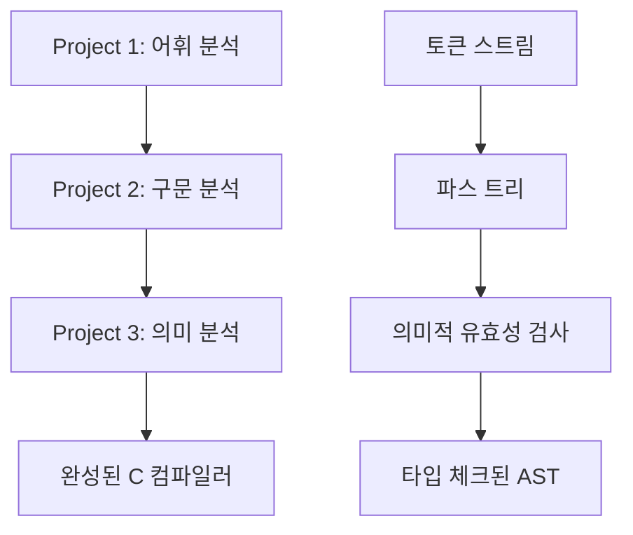

Project 3는 간단한 C 컴파일러 구현 프로젝트의 **최종 단계**로, **의미 분석(Semantic Analysis)**을 담당합니다. 

이전 단계인 Project 1 (어휘 분석)과 Project 2 (구문 분석)를 거쳐 생성된 토큰과 파스 트리를 기반으로, 입력 C 코드가 "의미"에 맞는지 검사하는 것이 주된 목적입니다.

### 🎯 주요 목표

| 목표 | 설명 |
|------|------|
| **의미적 유효성 검증** | Input C 코드의 의미적 유효성을 검증합니다 |
| **타입 체크** | 변수, 함수, 연산자의 타입 호환성을 검사합니다 |
| **선언 검증** | 선언되지 않은 변수/함수 사용을 탐지합니다 |
| **스코프 관리** | 변수의 스코프 범위를 올바르게 관리합니다 |

---

## ⚙️ 2. 구현 핵심 요소

## ⚙️ 2. 구현 핵심 요소

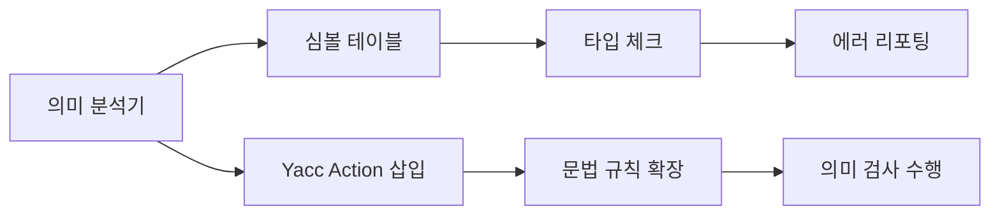

### 🔧 핵심 구성 요소

| 구성 요소 | 설명 | 우선순위 |
|-----------|------|----------|
| **의미 분석기 구현** | 실제 의미 분석 기능을 구현합니다 | 🔴 필수 |
| **심볼 테이블 구현** | 각 변수에 대한 정보(이름, 타입, 스코프)를 저장합니다 | 🔴 필수 |
| **Yacc Action 삽입** | `subc.y` 문법의 적절한 위치에 C 코드를 삽입합니다 | 🔴 필수 |
| **에러 메시지 출력** | 에러 발견 시 적절한 메시지를 출력합니다 | 🔴 필수 |

---

## 🔤 3. 어휘 분석기 (Lex - `subc.l`) 관련 요구사항

## 🔤 3. 어휘 분석기 (Lex - `subc.l`) 관련 요구사항

### 💬 주석(Comment) 지원

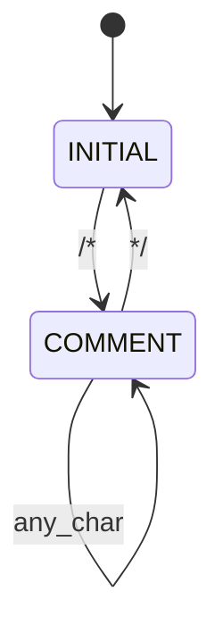

#### ✅ 구현 요구사항

| 항목 | 상세 내용 |
|------|-----------|
| **지원 형태** | `/* */` 형태의 주석만 지원 |
| **중첩 주석** | 고려하지 않음 (단순 구현) |
| **모드 활용** | `INITIAL`과 `COMMENT` 모드 사용 |

#### 🔧 구현 방법

```c
%x COMMENT

%%
"/*"            { BEGIN(COMMENT); }
<COMMENT>"*/"   { BEGIN(INITIAL); }
<COMMENT>.      { /* 주석 내용 무시 */ }
<COMMENT>\n     { /* 라인 번호 증가 처리 */ }
```

### 📍 라인 번호(Line Number) 관리

- **기능**: `get_lineno()` 함수로 현재 라인 번호 추적
- **자동 증가**: newline(`\n`) 스캔 시 자동으로 라인 번호 증가
- **상태**: skeleton code에 이미 구현되어 있음

### 📁 파일 이름(File Name) 전달

#### 🎯 목적
의미 에러 메시지 출력 시 파일 이름과 라인 번호를 함께 표시

#### 💾 구현 방법
```c
// 전역 변수 선언
char* filename;

// main 함수에서 파일 이름 복사
int main(int argc, char* argv[]) {
    if (argc > 1) {
        filename = (char*)malloc(strlen(argv[1]) + 1);
        strcpy(filename, argv[1]);
    }
    // ... 나머지 구현
}
```

### ⚠️ 문자열 연산 주의사항

| 함수 | 동작 | null 문자 포함 여부 |
|------|------|-------------------|
| `strcpy` | 문자열 복사 | ✅ 포함 |
| `strcmp` | 문자열 비교 | ✅ 포함 |
| `strlen` | 문자열 길이 | ❌ 제외 |

### 🔍 Lexeme 정보 활용

#### 중요 변수들

| 변수 | 타입 | 설명 | 주의사항 |
|------|------|------|----------|
| `yytext` | `char*` | 현재 매치된 lexeme 문자열 | 값이 덮어쓰기됨 |
| `yyleng` | `int` | lexeme 문자열 길이 (null 제외) | 값이 덮어쓰기됨 |

> ⚠️ **중요**: `yytext`와 `yyleng`는 각 토큰 인식 시마다 값이 덮어쓰이므로, lexeme 문자열을 **복사하여 저장**해야 합니다.

```c
// 올바른 사용 예시
char* saved_text = (char*)malloc(yyleng + 1);
strcpy(saved_text, yytext);
```

---

## 📝 4. 구문 분석기 (Yacc - `subc.y`) 관련 요구사항

## 📝 4. 구문 분석기 (Yacc - `subc.y`) 관련 요구사항

### 🔧 기본 개념

#### `%empty` 기호
- **용도**: ε (empty string)을 명시적으로 표현
- **문법**: 빈 production 규칙에서 사용

#### 액션(Action)
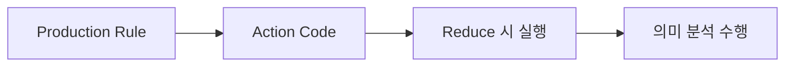

- **정의**: C 코드를 문법 production의 RHS(오른쪽)에 삽입
- **실행 시점**: 해당 production 파싱 중 (주로 reduce 시)

### 🔢 액션 변수(Action Variable)

| 변수 | 설명 | 예시 |
|------|------|------|
| `$i` | i번째 심볼의 값 | `$1`, `$2`, `$3` |
| `$$` | 현재 production LHS 심볼 값 | 결과 값 할당 |

#### 사용 예시
```c
expr : expr '+' term { $$ = $1 + $3; }  // $1: expr, $3: term
```

### 🔄 `yylval` 변수

#### 기본 개념
- **목적**: Lexer에서 Parser로 토큰 값 전달
- **기본 타입**: `int`

#### `%union` 활용
```c
%union { 
    int ival; 
    char* sval;
    TypeInfo* typeInfo;
}

%token <ival> NUM
%token <sval> ID
%token <typeInfo> TYPE
```

### ⚡ 미드-룰 액션(Mid-Rule Action)

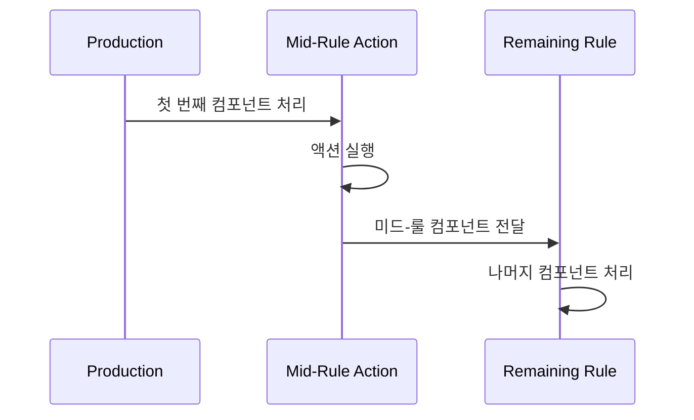

#### ⚠️ 주의사항

| 항목 | 제한사항 |
|------|----------|
| **접근 범위** | 바로 이전 컴포넌트(`$i`)만 접근 가능 |
| **충돌 가능성** | shift/reduce 충돌 발생 가능 |
| **해결책** | 첫 번째 비터미널/터미널 이후 삽입 권장 |

#### 구현 예시
```c
stmt : IF '(' { /* 조건 체크 시작 */ } expr ')' stmt
     | WHILE '(' { /* 루프 시작 */ } expr ')' stmt
```

---

## ✅ 5. 의미 분석 체크리스트

## ✅ 5. 의미 분석 체크리스트

### 🔍 개요
Project 3에서 구현해야 할 의미 분석 체크 항목들을 우선순위별로 정리했습니다.

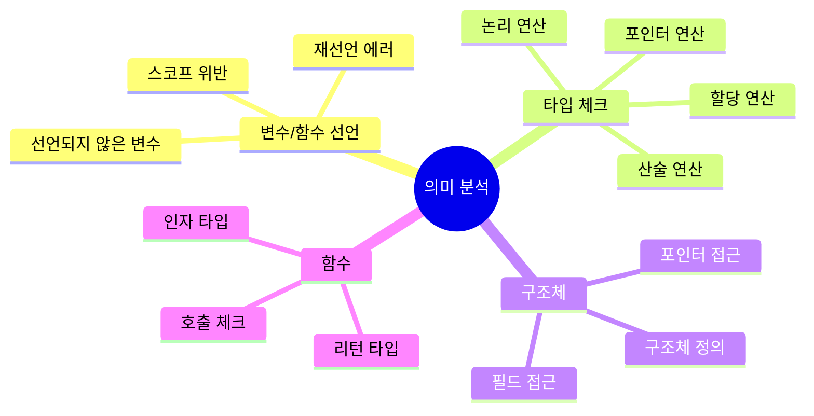

### 🚫 선언 관련 에러

#### 1️⃣ 선언되지 않은 변수 및 함수

| 에러 유형 | 예시 코드 | 에러 메시지 |
|-----------|-----------|-------------|
| **선언되지 않은 변수** | `a = 0;` (a 미선언) | `undeclared variable` |
| **스코프 위반** | `{ int a; } a = 0;` | `undeclared variable` |
| **정의되지 않은 함수** | `foo();` (foo 미정의) | `undeclared function` |

#### 2️⃣ 재선언 에러

```c
// 에러 예시
int x;
int x;  // ❌ 재선언 에러

struct Point { int x, y; };
struct Point { int x, y; };  // ❌ 재선언 에러
```

> 📝 **구현 편의상**: 변수, 구조체, 함수 등 서로 다른 종류끼리 이름이 겹치는 경우는 고려하지 않습니다.

### 🔢 타입 체크 상세

#### 3️⃣ 할당(Assignment) 체크

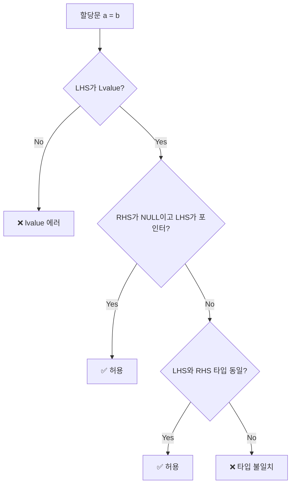

**체크 순서**:
1. LHS가 **Lvalue**인지 체크 (상수나 배열 이름 불가)
2. RHS가 `NULL`이고 LHS가 포인터 타입인지 체크
3. LHS와 RHS의 타입이 동일한지 체크

> ⚠️ **주의**: 암묵적 형변환은 허용되지 않습니다!

#### 4️⃣ 연산자별 타입 제한

| 연산자 분류 | 연산자 | 허용 타입 | 결과 타입 |
|-------------|--------|-----------|-----------|
| **이항 연산** | `+`, `-`, `*`, `/`, `%` | `int`만 | `int` |
| **논리 연산** | `&&`, `\|\|` | `int`만 | `int` |
| **관계 연산** | `>=`, `>`, `<=`, `<` | `int`, `char` | `int` |
| **등가 연산** | `==`, `!=` | `int`, `char`, `pointer` | `int` |
| **단항 연산** | `-`, `!` | `int`만 | `int` |
| **증감 연산** | `++`, `--` | `int`, `char` | 원래 타입 |

#### 5️⃣ 특수 연산자

**포인터 연산자**:
- `*` (역참조): RHS는 `pointer` 타입만 가능
- `&` (주소): RHS는 lvalue만 가능 (number, array, string 제외)
- `NULL`: 포인터 타입에만 할당 가능

**구조체 연산자**:
- `.`: LHS는 `struct` 타입, RHS는 해당 구조체의 필드명
- `->`: LHS는 `struct pointer` 타입, RHS는 해당 구조체의 필드명

**배열 연산자**:
- `a[i]`: `a`는 `array` 타입, `i`는 `int` 타입

### 🏗️ 구조체 관련

#### 구조체 정의 및 사용
- Struct 타입은 **사용 전에 정의**되어야 함
- 구조체는 **글로벌 선언**으로 처리 (스코프 적용 안 함)
- 구조체 포인터 선언 시 글로벌 타입 리스트에서 검색

#### 예시
```c
struct Point { int x, y; };  // 정의
struct Point p;              // ✅ 사용 가능
struct Line* l;              // ❌ Line 미정의
```

### 🔧 함수 관련

#### 함수 검사 항목

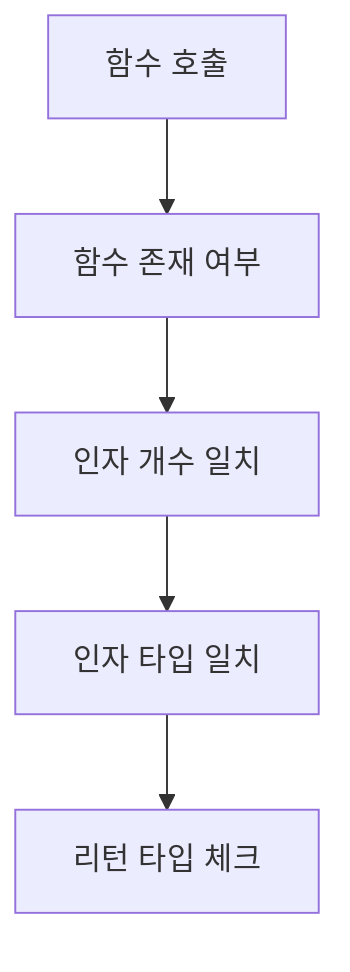

| 검사 항목 | 설명 |
|-----------|------|
| **리턴 타입** | 함수 정의의 리턴 타입과 실제 return문의 타입 일치 |
| **인자 타입** | 함수 호출 시 인자 타입과 함수 정의의 파라미터 타입 일치 |
| **함수 존재** | 선언되지 않은 함수 호출 방지 |

---

## 🗃️ 6. 심볼 테이블 및 타입 관리

## 🗃️ 6. 심볼 테이블 및 타입 관리

### 📚 스코프 기반 심볼 테이블

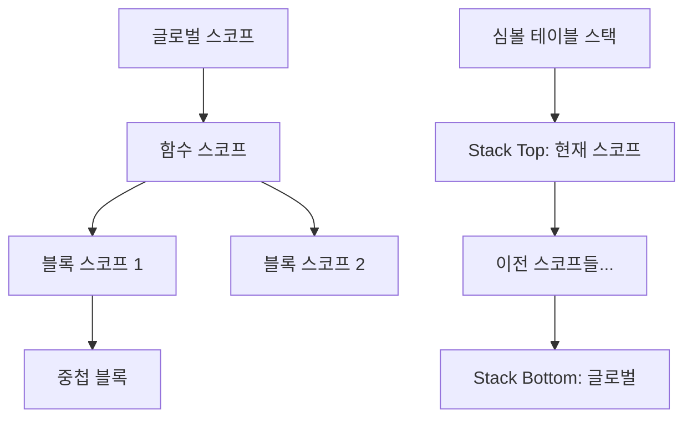

#### 🔧 구현 방법

**스택 구조 권장**:
- 각 스코프별로 하나의 심볼 테이블
- 새 스코프 진입 시: 테이블 생성 및 스택 push
- 스코프 종료 시: 스택 top 제거 (pop)
- 변수 검색 시: 스택 top부터 순차 탐색

#### 💾 데이터 구조

```c
// 심볼 테이블 노드 예시
typedef struct SymbolNode {
    char* name;              // 변수명
    TypeInfo* type;          // 타입 정보
    int isLvalue;            // lvalue 여부
    struct SymbolNode* next; // 다음 노드
} SymbolNode;

// 스코프 스택 예시
typedef struct ScopeStack {
    SymbolNode* symbols;     // 현재 스코프의 심볼들
    struct ScopeStack* prev; // 이전 스코프
} ScopeStack;
```

### 🏷️ 복합 타입 관리 (`TypeInfo` 구조체)

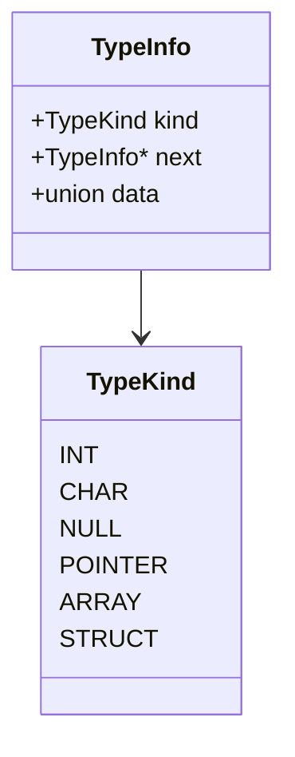

#### 📋 타입 종류

| 기본 타입 | 복합 타입 | 사용자 정의 |
|-----------|-----------|-------------|
| `int` | `Pointer` | `Struct` |
| `char` | `Array` | - |
| `NULL` | - | - |

#### 🔗 복합 타입 표현

**Linked List 방식**:
- `int*` → TypeInfo(POINTER) → TypeInfo(INT)
- `int**` → TypeInfo(POINTER) → TypeInfo(POINTER) → TypeInfo(INT)
- `int[10]` → TypeInfo(ARRAY) → TypeInfo(INT)

### 🌐 글로벌 타입 리스트

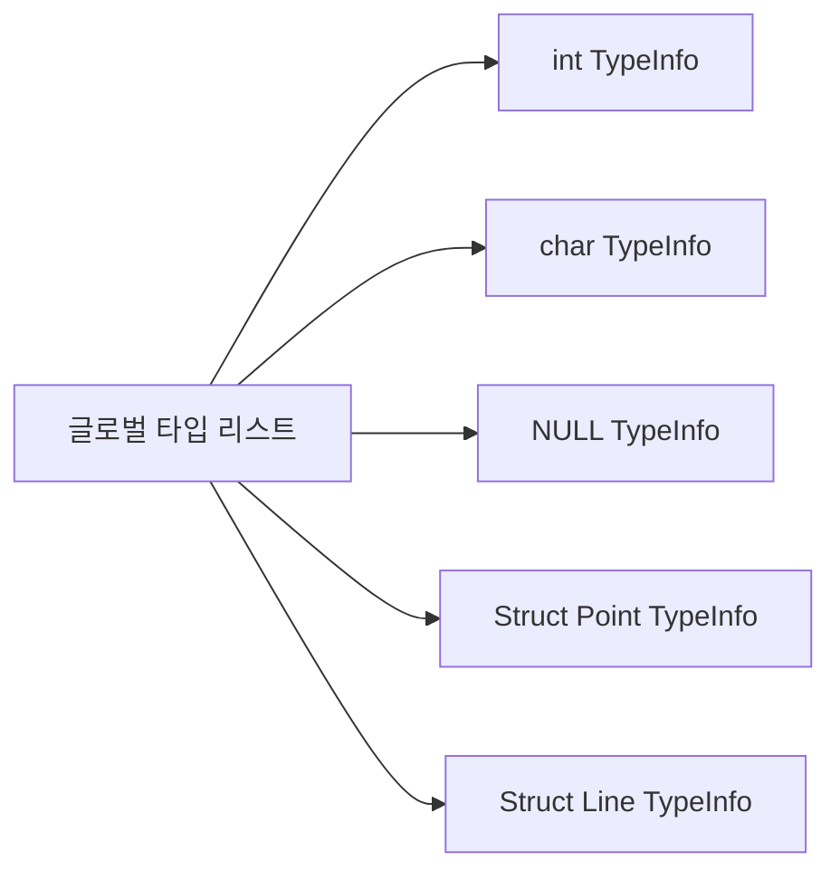

#### 🎯 목적
- 공유 가능한 `TypeInfo`들의 중앙 관리
- 메모리 효율성 향상
- 구조체 타입 검색 및 중복 방지

### 🏗️ 구조체 타입 관리

#### 구조체 정의 처리
```c
struct Point {
    int x;
    int y;
};
```

**처리 과정**:
1. 글로벌 타입 리스트에서 "Point" 검색
2. 존재하지 않으면 새 Struct TypeInfo 생성
3. 필드 정보 저장 (별도 심볼 테이블 활용)
4. 글로벌 리스트에 추가

### 🔧 함수 관리 (`FuncInfo` 구조체)

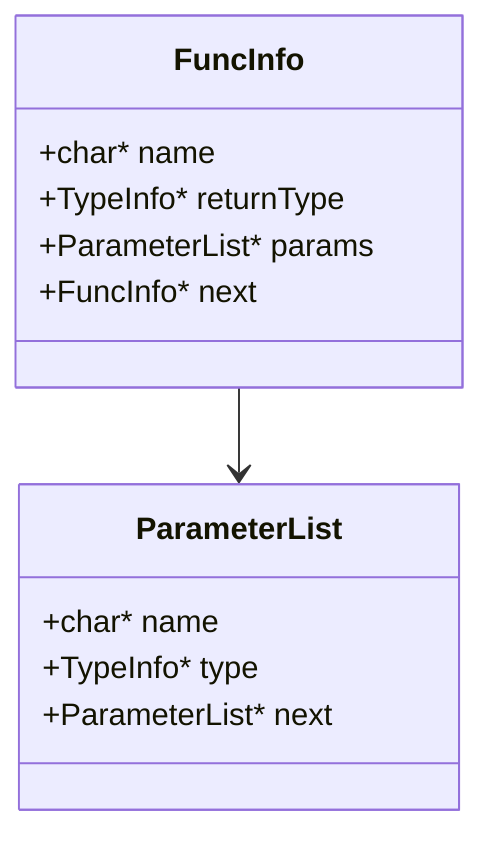

#### 📝 함수 정보 저장

| 항목 | 설명 |
|------|------|
| **함수명** | 함수 이름 |
| **리턴 타입** | 함수의 반환 타입 |
| **파라미터** | 매개변수 리스트 (이름, 타입) |

#### 🌐 글로벌 함수 리스트
- 모든 함수 정의를 중앙에서 관리
- 함수 호출 시 검색 및 타입 체크에 활용

### 📍 Lvalue 개념

#### 정의
**Lvalue**: 메모리 주소를 가져서 값을 저장할 수 있는 표현식

#### ✅ Lvalue 예시
```c
int a;        // ✅ 변수
int* p;       // ✅ 포인터
a[5]          // ✅ 배열 원소
p->field      // ✅ 구조체 필드
```

#### ❌ Non-lvalue 예시
```c
5             // ❌ 상수
array_name    // ❌ 배열 이름
a + b         // ❌ 표현식 결과
```

### 🔄 액션 코드 통합

#### 심볼 추가 예시
```c
def : type_specifier pointers ID ';' {
    // $1: type, $2: pointer_count, $3: identifier
    TypeInfo* finalType = buildCompleteType($1, $2);
    addSymbolToCurrentScope($3, finalType);
    $$ = NULL;
}
```

#### 스코프 관리 예시
```c
compound_stmt : '{' { pushNewScope(); } 
                def_list stmt_list 
                '}' { popScope(); }
```

---

## 📖 7. 문법 특징

프로젝트에 적용되는 문법(`subc.y` 및 `grammar.txt` 참조)은 기존 C 문법과 일부 차이가 있습니다.

*   변수를 선언과 동시에 초기화할 수 없습니다 (e.g., `int a = 0;`는 구문 에러).
*   익명 구조체 선언은 지원되지 않습니다 (e.g., `struct { int x; int y; } w;`는 구문 에러).
*   모든 변수 선언은 스코프(블록)의 첫 부분에 존재해야 합니다 (e.g., `int a; a = 5; int b;`는 구문 에러).
*   Syntax Error는 고려하지 않습니다 (채점용 테스트 코드에는 syntax error가 없음).

#### **8. 고려하지 않아도 되는 사항 (구현 편의)**

다음 항목들은 구현 편의상 고려하지 않아도 됩니다.

*   **함수**:
    *   자기 자신을 호출하는 재귀 함수(self-recursive).
    *   `return` 문이 없는 함수 (e.g., `void func() {}`).
    *   함수 오버로딩 (동일한 이름의 함수가 2개 이상 정의될 수 없음).
*   **구조체**:
    *   자기 자신을 멤버로 갖는 구조체.
*   변수, 구조체, 함수 등 **서로 다른 종류끼리 이름이 겹치는 경우**는 고려하지 않습니다.
*   문자열 할당 (e.g., `char* a = "hello";`).

#### **9. 메모리 오류 체크 (추가 점수 항목)**

*   **AddressSanitizer (Asan)**: C, C++ 언어에서 메모리 오류를 탐지하기 위한 런타임 도구입니다.
*   **탐지 가능한 오류**: Heap Buffer Overflow, Stack Buffer Overflow, Use-After-Free (해제된 메모리 접근), 메모리 누수(leak).
*   **컴파일 옵션**: 컴파일 시 `gcc -fsanitize=address -static-libasan -g` 옵션을 추가합니다.
*   필수 구현 사항은 아니지만, Asan으로 메모리 오류가 없는 경우 가산점이 부여됩니다.

#### **10. 출력 요구사항**

*   **에러 메시지 형식**:
    *   `<filename>:<line_num>: error: <description>` 형식으로 출력합니다.
    *   `"error"` 전, 후에 빈칸 하나씩을 삽입합니다.
    *   예: `test.c:5 error: redeclaration`.
    *   `subc.l`에 정의된 `get_lineno()` 함수를 활용합니다.
    *   스켈레톤 `subc.y` 내에 제공된 메시지 출력 함수(e.g., `"error_"`로 시작하는 함수들)를 활용합니다.
    *   **`error_preamble()` 함수를 구현**하여 라인 번호 및 파일 이름을 출력하도록 해야 합니다.
*   **여러 의미 에러 처리**:
    *   하나의 소스 코드 내에 여러 의미 에러가 존재하는 경우, **각각의 에러를 순차적으로 모두 출력**합니다.
    *   **에러가 발생한 statement 파싱에서는 에러 메시지 출력 후 심볼 값에 `NULL`을 할당**합니다 (`$$ = NULL;`).
    *   이전 reduce에서 받은 심볼 값이 `NULL`인 경우 액션 코드 수행 없이 진행합니다.
    *   하나의 소스 코드 라인에서 여러 에러가 존재하는 경우, 파싱할 때 **먼저 찾는 에러 1개만 출력**합니다. (예: `b = a;`에서 `lvalue is not assignable`과 `subscripted value is not an array` 중 먼저 reduce되는 에러만 출력).
    *   하나의 REDUCE에서 2개 이상 에러가 존재하는 경우는 고려하지 않습니다.

#### **11. 구현 팁**

*   **전역 변수 활용**: 구현 편의를 위해 전역 변수(e.g., 스코프 스택의 top 포인터, 현재 파싱 중인 함수의 리턴 타입 등)를 활용할 필요가 있습니다.
    *   `subc.h`에 정의하면 충돌이 발생할 수 있으므로, **별도의 C 파일 내부에 전역 변수를 선언**하는 것을 권장합니다.
*   **헬퍼 함수(Helper Function)**: 여러 액션 코드에서 자주 사용되는 코드는 C 함수로 만들고 호출하면 코드 유지 보수성이 높아집니다.
    *   함수들은 `subc.h`에 선언하고, 별도의 C 파일에 구현하며, 해당 C 파일 내부에서 전역 변수를 사용할 수 있습니다.

---

