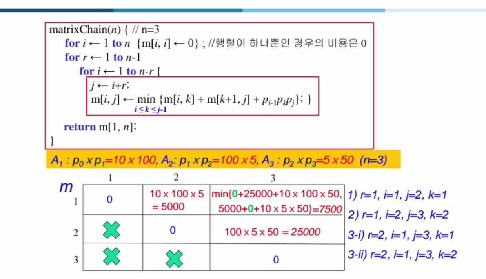

### **행렬 곱셈 순서 문제 - 표 부분 상세 설명**

주어진 표는 행렬 곱셈 순서를 결정하며 최소 곱셈 연산 수를 구하기 위한 **동적 프로그래밍** 접근법의 중간 결과를 보여줍니다. 이를 한 단계씩 분해하여 설명합니다.

#### **주어진 행렬의 차원**
- \( A_1 : 10 \times 100 \)
- \( A_2 : 100 \times 5 \)
- \( A_3 : 5 \times 50 \)

목표: \( A_1, A_2, A_3 \)를 곱할 때 곱셈의 총 횟수를 최소화하는 방법을 찾는다.

#### **표 내용 설명**
1. \( m[i, j] \): 행렬 \( A_i \)부터 \( A_j \)까지 곱하는 데 필요한 최소 곱셈 수를 저장.
2. \( m[i, i] = 0 \): 단일 행렬은 더 이상 곱할 필요가 없으므로 곱셈 비용이 0.
3. \( m[i, j] = \min \{ m[i, k] + m[k+1, j] + p_{i-1} \cdot p_k \cdot p_j \} \):
    - \( i \leq k < j \): \( k \)는 곱셈을 나눌 기준 지점.
    - \( p_{i-1}, p_k, p_j \): \( A_i \)와 \( A_j \)의 크기를 나타내는 행렬 곱셈의 차원.

---

### **표의 진행 과정**

#### **Step 1: 초기화**
- \( m[i, i] = 0 \), 즉 대각선에는 모두 0이 들어갑니다.

#### **Step 2: \( r = 1 \) (2개의 행렬 곱셈)**
- **Case 1 (\( i=1, j=2, k=1 \)):**
    - \( m[1, 2] = m[1, 1] + m[2, 2] + p_0 \cdot p_1 \cdot p_2 \)
    - \( = 0 + 0 + 10 \cdot 100 \cdot 5 = 5000 \)

- **Case 2 (\( i=2, j=3, k=2 \)):**
    - \( m[2, 3] = m[2, 2] + m[3, 3] + p_1 \cdot p_2 \cdot p_3 \)
    - \( = 0 + 0 + 100 \cdot 5 \cdot 50 = 25000 \)

#### **Step 3: \( r = 2 \) (3개의 행렬 곱셈)**
- **Case 1 (\( i=1, j=3, k=1 \)):**
    - \( m[1, 3] = m[1, 1] + m[2, 3] + p_0 \cdot p_1 \cdot p_3 \)
    - \( = 0 + 25000 + 10 \cdot 100 \cdot 50 = 75000 \)

- **Case 2 (\( i=1, j=3, k=2 \)):**
    - \( m[1, 3] = m[1, 2] + m[3, 3] + p_0 \cdot p_2 \cdot p_3 \)
    - \( = 5000 + 0 + 10 \cdot 5 \cdot 50 = 7500 \)

최종적으로 \( m[1, 3] = \min \{ 75000, 7500 \} = 7500 \).

---

### **최종 결과**
- 최적의 행렬 곱셈 순서는 \( (A_1(A_2A_3)) \).
- 최소 곱셈 연산 횟수는 **7500번**입니다.

---

### **출제 가능한 문제들**

1. **행렬 곱셈 최소 비용 계산**
    - 주어진 행렬 차원이 \( A_1: 5 \times 10 \), \( A_2: 10 \times 20 \), \( A_3: 20 \times 30 \)일 때, 최소 곱셈 비용을 계산하시오.
    - 풀이: 동적 프로그래밍 테이블을 작성하고 최소 비용을 계산.

2. **행렬 곱셈 순서**
    - \( A_1: 10 \times 100 \), \( A_2: 100 \times 5 \), \( A_3: 5 \times 50 \), \( A_4: 50 \times 10 \)인 경우, 최적의 곱셈 순서를 구하시오.

3. **의사코드 작성**
    - 행렬 곱셈 순서를 동적 프로그래밍으로 계산하는 의사코드를 작성하시오.

4. **테이블 채우기**
    - 초기 테이블의 일부가 제공되었을 때, 나머지 값을 계산하고 결과를 도출하시오.

이 문제들은 다양한 수준에서 테스트할 수 있도록 설계되었습니다. 필요하면 풀이와 힌트도 제공해 드릴게요!

