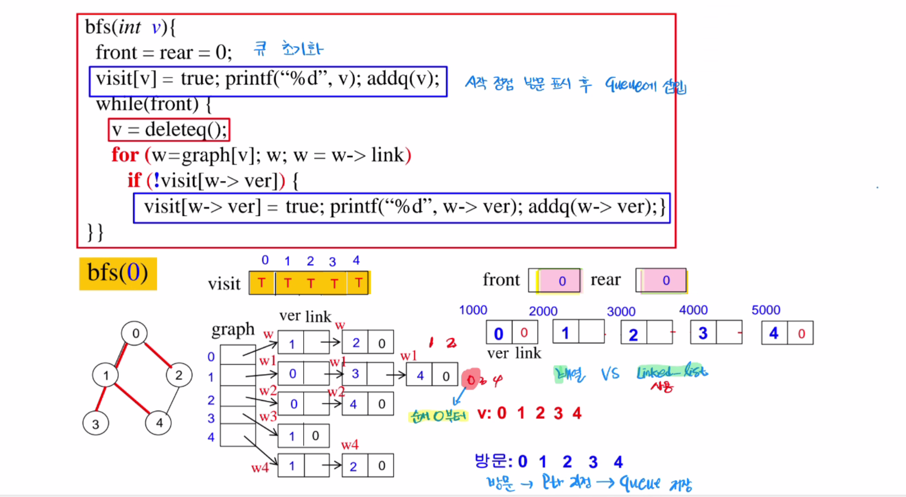

주어진 코드는 너비 우선 탐색(BFS, Breadth-First Search)을 구현한 알고리즘입니다. 아래에서 코드와 과정을 단계별로 설명하겠습니다.

---

### **1. BFS 알고리즘 개요**
- BFS는 그래프 탐색 알고리즘으로, **큐(Queue)** 자료구조를 사용해 현재 노드와 인접한 노드를 먼저 탐색하는 방식입니다.
- BFS의 특징:
    1. 시작 노드에서 가까운 노드부터 방문.
    2. 모든 노드를 방문하기 위해 큐에 삽입하고, 방문 순서를 제어.

---

### **2. 주어진 그래프**
- 노드: \( 0, 1, 2, 3, 4 \)
- 간선(Edge): 그림에서 빨간 선으로 표시된 연결 관계.

노드의 연결 정보(인접 리스트 방식):
- \( 0 \): \( 1 \to 2 \)
- \( 1 \): \( 0 \to 3 \to 4 \)
- \( 2 \): \( 0 \)
- \( 3 \): \( 1 \)
- \( 4 \): \( 1 \)

---

### **3. BFS 코드 단계**
#### 초기화
```c
front = rear = 0;
visit[v] = true; printf("%d", v); addq(v);
```
- **front, rear**: 큐의 앞과 뒤를 나타내는 변수로 큐를 초기화.
- 시작 노드 \( v = 0 \):
    - 방문 여부 기록: \( visit[0] = true \)
    - 방문 출력: \( printf("%d", v) \) → \( 0 \) 출력.
    - 큐에 추가: \( addq(0) \).

큐 상태: **[0]**

---

#### 탐색 루프
```c
while (front) {
    v = deleteq();
    for (w = graph[v]; w; w = w->link) {
        if (!visit[w->ver]) {
            visit[w->ver] = true;
            printf("%d", w->ver);
            addq(w->ver);
        }
    }
}
```
1. **큐에서 노드 제거**:
    - \( v = deleteq() \): 큐에서 현재 노드 \( v \)를 제거.
    - 현재 노드 \( v \)의 인접 리스트 탐색.

2. **인접 노드 탐색**:
    - \( w = graph[v] \): 노드 \( v \)에 연결된 첫 번째 인접 노드를 가져옴.
    - 방문하지 않은 노드만 처리:
        - 방문 표시: \( visit[w->ver] = true \)
        - 방문 출력: \( printf("%d", w->ver) \)
        - 큐에 삽입: \( addq(w->ver) \)

---

### **4. 과정 시뮬레이션**
#### 초기 상태:
- 방문 배열: \( [T, F, F, F, F] \)
- 큐 상태: **[0]**

#### 1단계 (노드 \( 0 \) 탐색):
- \( v = 0 \) (큐에서 제거).
- 인접 노드: \( 1 \to 2 \).
- \( 1 \) 방문:
    - 방문 배열: \( [T, T, F, F, F] \).
    - 출력: \( 1 \).
    - 큐 추가: \( [1] \).
- \( 2 \) 방문:
    - 방문 배열: \( [T, T, T, F, F] \).
    - 출력: \( 2 \).
    - 큐 추가: \( [1, 2] \).

#### 2단계 (노드 \( 1 \) 탐색):
- \( v = 1 \) (큐에서 제거).
- 인접 노드: \( 0 \to 3 \to 4 \).
- \( 0 \): 이미 방문.
- \( 3 \) 방문:
    - 방문 배열: \( [T, T, T, T, F] \).
    - 출력: \( 3 \).
    - 큐 추가: \( [2, 3] \).
- \( 4 \) 방문:
    - 방문 배열: \( [T, T, T, T, T] \).
    - 출력: \( 4 \).
    - 큐 추가: \( [2, 3, 4] \).

#### 3단계 (노드 \( 2 \) 탐색):
- \( v = 2 \) (큐에서 제거).
- 인접 노드: \( 0 \).
- \( 0 \): 이미 방문.
- 큐 상태: \( [3, 4] \).

#### 4단계 (노드 \( 3 \) 탐색):
- \( v = 3 \) (큐에서 제거).
- 인접 노드: \( 1 \).
- \( 1 \): 이미 방문.
- 큐 상태: \( [4] \).

#### 5단계 (노드 \( 4 \) 탐색):
- \( v = 4 \) (큐에서 제거).
- 인접 노드: \( 1 \).
- \( 1 \): 이미 방문.
- 큐 상태: **빈 큐**.

---

### **5. 방문 순서**
최종 방문 순서: \( 0 \to 1 \to 2 \to 3 \to 4 \)

---

### **6. 큐 상태 변화**
1. 초기 상태: \( [0] \)
2. \( 0 \) 탐색 후: \( [1, 2] \)
3. \( 1 \) 탐색 후: \( [2, 3, 4] \)
4. \( 2 \) 탐색 후: \( [3, 4] \)
5. \( 3 \) 탐색 후: \( [4] \)
6. \( 4 \) 탐색 후: 빈 큐

---

### **7. 시간 복잡도**
- 모든 노드와 간선을 한 번씩 탐색하므로 시간 복잡도는 \( O(V + E) \)입니다.
    - \( V \): 노드의 개수.
    - \( E \): 간선의 개수.

