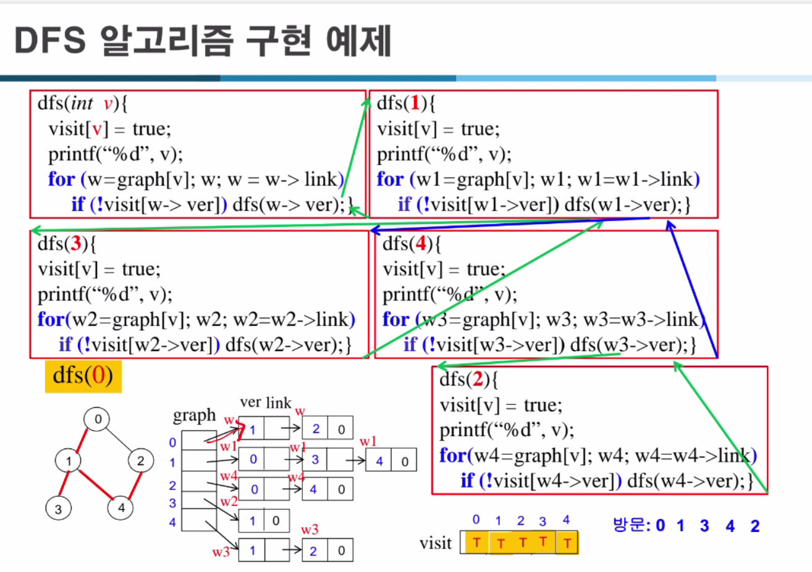

아래는 그림 속 DFS(깊이 우선 탐색, Depth First Search) 알고리즘 구현 예제에 대한 과정 설명입니다. 기본 아이디어는 시작 정점에서부터 인접한 정점을 재귀적으로 깊게 들어가며 방문하는 것입니다. 한 번 방문한 정점은 다시 방문하지 않도록 `visit[]` 배열을 사용합니다.

### 코드 개요

```c
dfs(int v) {
    visit[v] = true;         // 현재 정점 v를 방문 처리
    printf("%d", v);         // v를 출력(혹은 기록)
    for (w = graph[v]; w; w = w->link) {  
        // graph[v]로부터 시작하는 인접 리스트를 순회한다.
        // w는 v에 인접한 정점들을 표현하는 노드(포인터)
        if (!visit[w->ver])  // w->ver는 v와 연결된 인접 정점 번호
            dfs(w->ver);     // 아직 방문하지 않았다면 재귀적으로 DFS 진행
    }
}
```

- `visit[]`: 각 정점의 방문 여부를 저장하는 배열. 초기에는 모두 `false`.
- `graph[]`: 각 정점별로 인접한 정점들의 연결 리스트를 가리키는 포인터 배열.
- `w->ver`: 현재 탐색 중인 인접 노드의 정점 번호.
- `w->link`: 다음 인접 정점으로 이동하기 위한 링크(포인터).

### 실행 과정 예시 (dfs(0) 호출 시나리오)

아래는 예시에 나온 그래프 구조를 바탕으로 단계별 탐색 과정을 추적한 것입니다. 그래프는 0,1,2,3,4번 정점으로 이루어져 있고, 각 정점과 연결된 인접 정점들이 그림으로 표현되어 있습니다.

1. **dfs(0) 호출**
    - `visit[0] = true`로 설정. 출력: `0`
    - `graph[0]`에서 시작하여 0번 정점에 인접한 정점을 확인.
    - 예를 들어 0번 정점과 연결된 정점이 1번 정점이라고 하면, `visit[1]`이 아직 `false`이므로 `dfs(1)` 호출.

2. **dfs(1) 호출**
    - `visit[1] = true`로 설정. 출력: `1`
    - `graph[1]`에서 시작하여 1번 정점과 인접한 정점 목록을 순회.
    - 인접 정점 중 방문하지 않은 정점(예: 3번 정점)이 있다면 `dfs(3)` 호출.

3. **dfs(3) 호출**
    - `visit[3] = true`. 출력: `3`
    - `graph[3]`를 순회하며 3번 정점에 연결된 정점을 찾는다.
    - 인접 정점 중 방문하지 않은 정점(예: 4번 정점)이 있으면 `dfs(4)` 호출.

4. **dfs(4) 호출**
    - `visit[4] = true`. 출력: `4`
    - `graph[4]`를 순회하며 4번 정점에 연결된 정점들을 확인.
    - 방문하지 않은 정점(예: 2번 정점)이 있으면 `dfs(2)` 호출.

5. **dfs(2) 호출**
    - `visit[2] = true`. 출력: `2`
    - `graph[2]`를 순회하며 2번 정점에 인접한 정점들 확인.
    - 만약 이미 모두 방문되어 있다면 더 이상 재귀 호출 없이 dfs(2) 종료.

이후 재귀 호출이 끝나면 스택을 타고 다시 상위 호출로 돌아간다. 즉, dfs(2)가 끝나면 dfs(4)로 복귀, dfs(4)에 더 이상 탐색할 정점이 없으므로 dfs(4) 종료 → dfs(3) 복귀 → 더 이상 3에서 탐색할 정점 없으므로 종료 → dfs(1) 복귀 → dfs(1)에서 다른 미방문 인접 정점이 없다면 종료 → dfs(0) 복귀 → dfs(0) 또한 다른 인접 정점이 없다면 종료.

### 방문 순서 분석

위 과정을 통해 탐색한 정점 출력 순서는 호출 시점에 따라 달라질 수 있지만, 제공된 그림의 예제 순서는 `0 -> 1 -> 3 -> 4 -> 2` 입니다. 각 호출 시점에서 `visit[]` 배열과 현재 방문한 정점의 상태가 그림 하단에 표시됩니다.

### 정리

- DFS는 시작 정점에서 방문할 수 있는 한 계속해서 깊이 내려가는 탐색 방식입니다.
- 각 단계에서 현재 정점과 인접한 노드를 하나씩 방문하며, 이미 방문한 정점은 다시 방문하지 않도록 `visit[]`를 체크합니다.
- 모든 재귀 호출이 종료되면 DFS도 종료되고, 탐색한 순서가 확정됩니다.
- 예제에서 보인 바와 같이 DFS의 실행 흐름은 재귀적으로 함수를 호출하며, 모든 인접 정점을 처리할 때까지 깊이 들어간 뒤, 더 이상 진행할 수 없을 경우 한 단계씩 되돌아오며 다른 갈래를 탐색하게 됩니다.