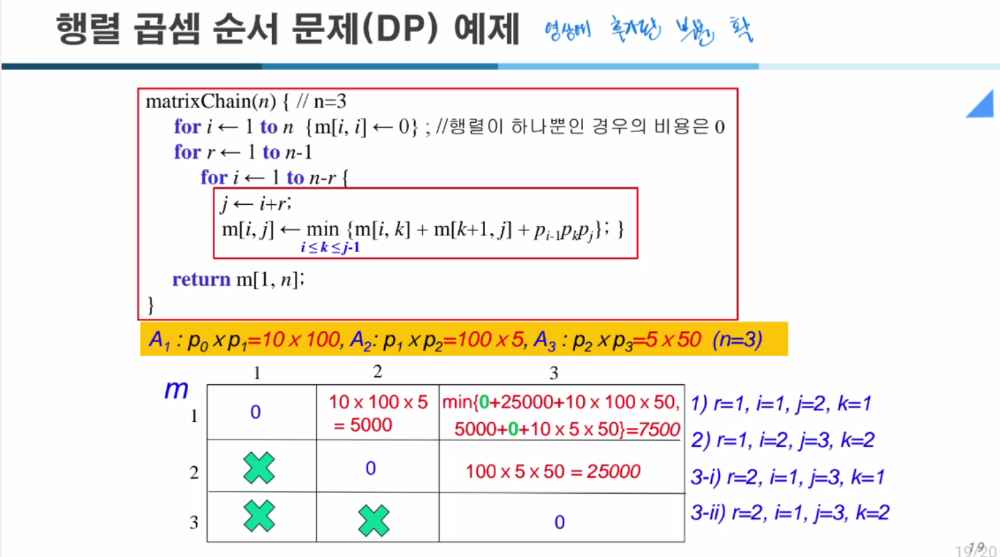

### 문제 상황 정리

다음과 같은 세 개의 행렬 \((A_1, A_2, A_3)\)가 있다고 합시다.

- \(A_1\)의 크기: \(10 x 100\)
- \(A_2\)의 크기: \(100 x 5\)
- \(A_3\)의 크기: \(5 x 50\)

여기서 행렬의 크기를 정의하는 수열 \(p\)를 생각해보면,
\[
p_0 = 10, \quad p_1 = 100, \quad p_2 = 5, \quad p_3 = 50
\]
즉, 첫 번째 행렬 \(A_1\)는 \(p_0 x p_1 = 10 x 100\), 두 번째 행렬 \(A_2\)는 \(p_1 x p_2 = 100 x 5\), 세 번째 행렬 \(A_3\)는 \(p_2 x p_3 = 5 x 50\)입니다.

최적의 곱셈 순서를 찾을 때, 가능한 곱셈 순서는 크게 두 가지입니다.

1. \((A_1 A_2) A_3\)로 곱하는 경우
2. \(A_1 (A_2 A_3)\)로 곱하는 경우

### 연산 비용 계산 방식

행렬 \((m x n)\)와 \((n x k)\)를 곱하면 연산 횟수는 \(m x n x k\)이 됩니다(스칼라 곱셈 연산 횟수).

위에서 언급한 두 가지 곱셈 순서에 대해 연산 비용을 직접 계산해보겠습니다.

#### 1. \((A_1 A_2) A_3\) 경우

먼저 \((A_1 A_2)\)를 계산합니다.

- \(A_1\)은 \(10 x 100\)
- \(A_2\)는 \(100 x 5\)
  이를 곱하면 결과는 \(10 x 5\) 크기의 행렬이 되고, 연산 횟수는 \(10 x 100 x 5 = 5000\)번입니다.

이제 이렇게 나온 \((A_1A_2)\) 결과(\(10 x 5\) 크기)와 \(A_3 (5 x 50)\)를 곱합니다.

- \((A_1A_2)\): \(10 x 5\)
- \(A_3\): \(5 x 50\)
  연산 횟수는 \(10 x 5 x 50 = 2500\)번입니다.

총 연산 횟수: 첫 번째 곱 5000 + 두 번째 곱 2500 = **7500번**

#### 2. \(A_1 (A_2 A_3)\) 경우

이번엔 \((A_2 A_3)\)를 먼저 계산해봅시다.

- \(A_2\): \(100 x 5\)
- \(A_3\): \(5 x 50\)
  연산 횟수: \(100 x 5 x 50 = 25,000\)번

그 결과는 \(100 x 50\)크기의 행렬입니다. 이를 \(A_1 (10 x 100)\)와 곱하면:

- \(A_1\): \(10 x 100\)
- \((A_2A_3)\): \(100 x 50\)
  연산 횟수: \(10 x 100 x 50 = 50,000\)번

총 연산 횟수: 첫 번째 곱 25,000 + 두 번째 곱 50,000 = **75,000번**

### 두 순서의 비교

- \((A_1 A_2) A_3\) : 7,500번
- \(A_1 (A_2 A_3)\) : 75,000번

따라서 \((A_1 A_2) A_3\) 순서로 곱하는 것이 훨씬 적은 계산량(7,500번)으로 행렬 곱셈을 완료할 수 있습니다.

### DP 표 구성 과정

동적 계획 알고리즘에서 사용하는 점화식은 다음과 같습니다.

\[
m[i,j] = \min_{i \leq k < j} \{ m[i,k] + m[k+1,j] + p_{i-1} x p_k x p_j \}
\]

여기서 \(m[i,j]\)는 행렬 \(A_i\)부터 \(A_j\)까지를 곱하는데 필요한 최소 연산 횟수입니다.

초기 조건: \(m[i,i] = 0\) (단 하나의 행렬만 있을 때 곱셈 비용은 0)

이 문제에서는 \(n=3\)이므로 다음과 같이 구성할 수 있습니다.

- \(m[1,1]=0\), \(m[2,2]=0\), \(m[3,3]=0\)

이제 사슬의 길이를 하나씩 늘려가며 최소값을 구합니다.

#### 사슬 길이 r=1일 때 (인접한 두 행렬만 곱할 때)

1. \(m[1,2]\):
    - 가능한 분할: k=1
    - 비용: \(m[1,1] + m[2,2] + p_0 x p_1 x p_2 = 0 + 0 + (10 x 100 x 5) = 5,000\)
      따라서 \(m[1,2] = 5,000\)

2. \(m[2,3]\):
    - 가능한 분할: k=2
    - 비용: \(m[2,2] + m[3,3] + p_1 x p_2 x p_3 = 0 + 0 + (100 x 5 x 50) = 25,000\)
      따라서 \(m[2,3] = 25,000\)

이로써 r=1에 대한 DP 테이블:

| i\j | 1    | 2      | 3       |
|-----|-------|--------|---------|
| 1   | 0     | 5,000  |         |
| 2   |       | 0      | 25,000  |
| 3   |       |        | 0       |

#### 사슬 길이 r=2일 때

이제 \(m[1,3]\)를 계산해야 합니다. (A1, A2, A3 모두 곱하는 최소 비용)

- 가능한 분할: k=1 또는 k=2

1) k=1로 분할:
    - 비용: \(m[1,1] + m[2,3] + p_0 x p_1 x p_3\)
    - \(= 0 + 25,000 + (10 x 100 x 50)\)
    - \(= 25,000 + 50,000 = 75,000\)

2) k=2로 분할:
    - 비용: \(m[1,2] + m[3,3] + p_0 x p_2 x p_3\)
    - \(= 5,000 + 0 + (10 x 5 x 50)\)
    - \(= 5,000 + 2,500 = 7,500\)

두 경우를 비교하면 최소값은 7,500입니다. 따라서 \(m[1,3] = 7,500\).

최종 DP 테이블은 다음과 같습니다.

| i\j | 1    | 2      | 3       |
|-----|-------|--------|---------|
| 1   | 0     | 5,000  | 7,500   |
| 2   |       | 0      | 25,000  |
| 3   |       |        | 0       |

### 결론

최소 연산 횟수는 \(m[1,3] = 7,500\)입니다. 이것은 사슬 곱셈 순서가 \((A_1 A_2) A_3\)로 진행될 때 최소가 됨을 보여줍니다.

위 과정은 코드에서 보여준 바와 같이, 점화식을 바탕으로 점진적으로 문제를 확장해가며 최소 비용을 찾는 전형적인 동적 계획법 풀이입니다.