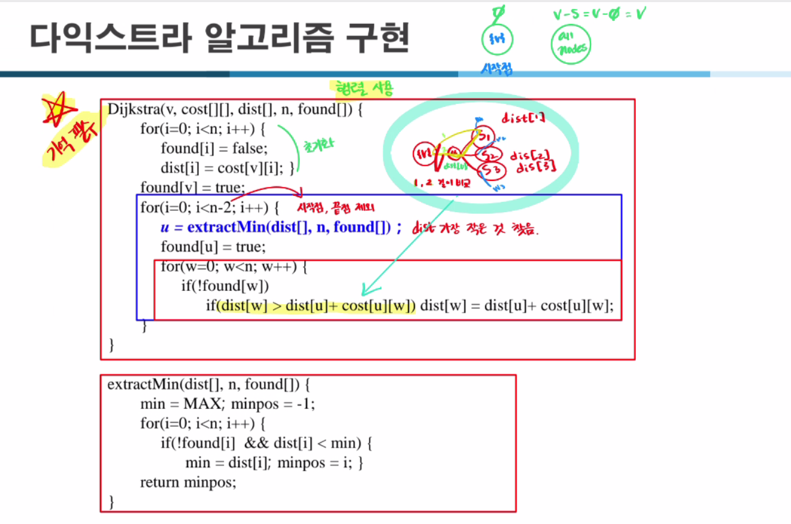

## 다익스트라 알고리즘 핵심 아이디어
- **목적**: 가중치가 있는 그래프에서 한 시작 정점으로부터 다른 모든 정점까지의 최단 경로를 찾는 알고리즘 (단, 음수 간선 가중치가 없어야 함).
- **아이디어**: 시작점으로부터 현재까지 찾은 최단 거리를 저장하는 배열(dist)을 유지하고, 방문하지 않은 정점 중 dist 값이 가장 작은 정점을 찾아 그 정점을 확정(Found set에 추가)하고, 그 정점으로부터 갈 수 있는 인접 정점들의 dist 값을 갱신한다.
- **반복**:
    1. 아직 방문하지 않은 정점 중 dist 값이 최소인 정점 u를 찾는다.
    2. u를 ‘방문 확정’으로 표시한 뒤, u로부터 갈 수 있는 다른 정점 w에 대해 `dist[w]` 값을 `dist[u] + cost[u][w]`로 필요시 갱신한다.
    3. 모든 정점이 확정될 때까지(또는 방문하지 않은 정점이 없을 때까지) 1~2를 반복.

## 기본 코드 구조 (의사 코드)

```c
Dijkstra(v, cost[][], dist[], n, found[]) {
    // 초기화
    for (i = 0; i < n; i++) {
        found[i] = false;
        dist[i] = cost[v][i];   // 시작점 v로부터 i까지의 초기 비용
    }
    found[v] = true; // 시작점은 바로 확정
    dist[v] = 0;     // 자기 자신까지의 거리는 0

    // n-1번 반복(혹은 n-2번: 시작점은 이미 확정했으므로)
    for (i = 0; i < n-1; i++) {
        u = extractMin(dist, n, found); // 아직 미확정인 정점 중 최단 거리 최소인 정점 u 찾기
        found[u] = true; // u 확정

        // u와 인접한 정점 w들 거리 갱신
        for (w = 0; w < n; w++) {
            if (!found[w]) { // 아직 확정 안 됨
                if (dist[w] > dist[u] + cost[u][w]) {
                    dist[w] = dist[u] + cost[u][w];
                }
            }
        }
    }
}
```

그리고 `extractMin()` 함수는 다음과 같이 `found[]` 배열에서 아직 확정되지 않은 정점 중 `dist[]`값이 최소인 정점 인덱스를 반환합니다.

```c
extractMin(dist[], n, found[]) {
    min = 무한대; 
    minpos = -1;
    for (i = 0; i < n; i++) {
        if (!found[i] && dist[i] < min) {
            min = dist[i];
            minpos = i;
        }
    }
    return minpos;
}
```

## 암기를 위한 단계별 전략

1. **의미 단위로 나누기**:  
   코드를 단순 나열이 아닌, 의미 있는 덩어리로 나눈 뒤, 각 덩어리별로 이해한다.
    - 초기화 블록: `dist[]`와 `found[]`를 초기화하고 `start` 정점(v)을 확정.
    - 메인 루프: `n-1`번 반복하며 `extractMin()`으로 최단 거리 확정할 정점 찾기.
    - 거리 갱신 루프: 선택된 u를 통해 다른 정점들의 dist 갱신.

2. **키워드 중심으로 기억하기**:
    - `found[]`: 특정 정점이 최단경로 확정인지 아닌지 관리
    - `dist[]`: 현재까지 알려진 최단거리
    - `extractMin()`: 미확정인 정점 중 dist 최소인 정점 찾기
    - `dist[w] = dist[u] + cost[u][w]`를 통해 갱신

   이런 핵심 키워드를 문장으로 묶어 기억:
   > "found로 확정 관리, dist로 거리 관리, extractMin으로 최소 dist 정점 선정, dist 갱신 공식: dist[w] > dist[u]+cost[u][w]면 갱신."

3. **흐름을 스토리로 만들기**:  
   “처음에 모두 무한대로, 시작점만 0으로 둔다.  
   매 단계마다 방문 안 한 노드 중 현재 dist가 최소인 u를 찾는다.  
   u를 확정(found[u]=true)하고, u에서 갈 수 있는 w들의 dist를 갱신한다.”

   이 과정을 한 문장으로 요약해보면:
   > "처음엔 시작점 거리=0, 나머지는 무한대. 방문 안 한 노드 중 dist 제일 작은 u 선택, u 확정 후 u 인접노드 거리 갱신. 이걸 모든 노드 확정될 때까지 반복."

   이 스토리를 머릿속에 그리며, 코드 구조를 떠올린다.

4. **데이터 구조 연상**:
    - `dist[]`, `found[]`: 1차원 배열로 관리
    - `cost[][]`: 인접행렬 형태(또는 인접 리스트)

   배열 인덱스 접근이 익숙해지면 코드 기억이 쉬워진다.

5. **빈 종이에 pseudo-code 작성**:  
   암기할 때 빈 종이에 직접 한 번 써보는 것이 가장 좋다. 처음에는 의사 코드 형태로(변수명 편하게) 쓴 뒤, 두세 번 반복하면 구조가 머리에 들어온다.

6. **계산 예시 들어보기**:  
   4~5개의 노드로 된 간단한 그래프를 하나 두고, 직접 dist 배열 변화를 추적해본다. 이 과정을 직접 손으로 해보면 코드가 자연스럽게 외워진다. 어떤 정점이 선택되는지, dist가 어떻게 갱신되는지를 한 번만 손으로 따라가도 머릿속에 흐름이 정리된다.

7. **유사성 있는 알고리즘과 비교하기**:  
   다익스트라는 일종의 그리디한 방식으로 MST의 Prim 알고리즘과 비슷한 흐름을 가진다(Prim은 최소 스패닝 트리, Dijkstra는 최단 경로).  
   Prim 알고리즘을 안다면, "Prim 알고리즘이 최소 스패닝 트리에서 정점 하나씩 늘려가듯, 다익스트라도 비슷하게 최단거리 확정 정점(집합 S)을 하나씩 늘려간다"라고 연관 지으면 암기하기 더 쉽다.

## 추가 팁

- **주석 달기**: 코드를 볼 때 자기만의 주석을 풍부하게 달아둔 뒤, 그 주석 흐름을 외운다.
- **코드 구조를 단순화해보기**:  
  함수나 변수명을 간소화해서 자신만의 버전으로 다시 적어본다.  
  예: `found[]` → `visited[]`, `extractMin()` → `selectShortestNode()`

- **프레임워크화**:
    1) 초기화
    2) 반복:
        - 선택 u
        - u 확정
        - 인접 노드 dist 갱신

  이 3단계 틀을 외우고, 그 틀 안에 코드를 채워 넣는 식으로 하면 구조를 기억하기 쉽다.

---


