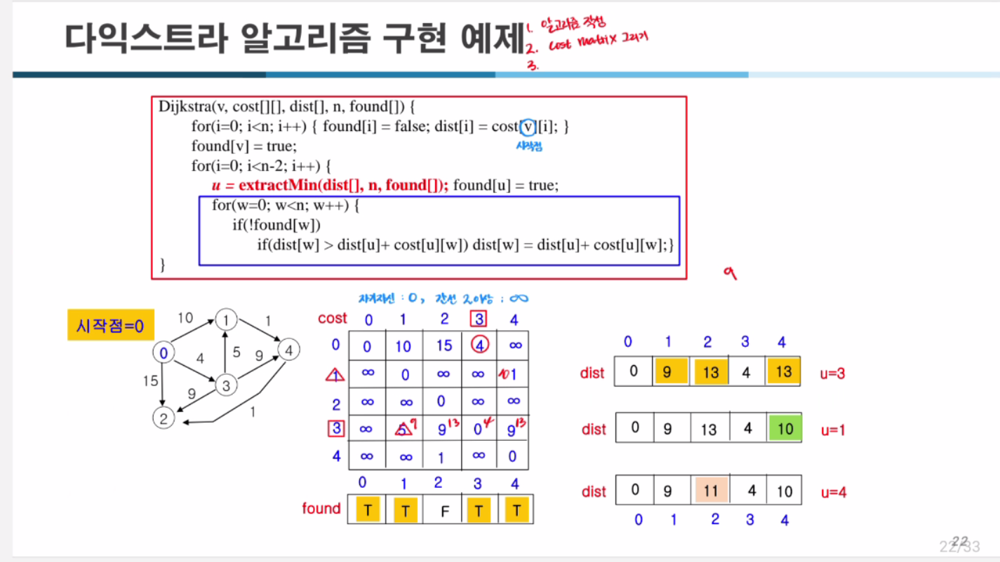

### 다익스트라(Dijkstra) 알고리즘 코드 상세 설명

다익스트라 알고리즘은 **그래프에서 단일 시작 노드로부터 모든 노드까지의 최단 경로를 계산**하는 알고리즘입니다. 아래 코드와 함께 단계별로 설명합니다.

---

### **1. 코드의 주요 함수**

#### **1-1. `Dijkstra(v, cost[][], dist[], n, found[])`**
- **목적**:
    - 주어진 그래프에서 시작 노드 \( v \)로부터 다른 모든 노드까지의 최단 거리를 계산.
- **입력**:
    - \( v \): 시작 노드.
    - `cost[][]`: 가중치 인접 행렬 (각 노드 간의 비용).
    - `dist[]`: 시작 노드 \( v \)에서 각 노드까지의 최단 거리.
    - \( n \): 그래프의 노드 수.
    - `found[]`: 최단 거리가 확정된 노드를 기록하는 배열.
- **출력**:
    - 각 노드까지의 최단 거리가 `dist[]`에 저장.

#### **1-2. `extractMin(dist[], n, found[])`**
- **목적**:
    - 아직 방문하지 않은 노드 중, `dist[]` 값이 가장 작은 노드를 반환.
- **입력**:
    - `dist[]`: 시작 노드로부터의 거리 정보.
    - \( n \): 노드 수.
    - `found[]`: 방문 여부를 기록하는 배열.
- **출력**:
    - 최단 거리 노드의 인덱스.

---

### **2. `Dijkstra` 함수의 주요 단계**

#### **초기화**
```c
for (i = 0; i < n; i++) {
    found[i] = false;
    dist[i] = cost[v][i];
}
found[v] = true;
```
- **목적**:
    1. 모든 노드를 방문하지 않은 상태로 초기화: \( found[i] = false \).
    2. 시작 노드 \( v \)에서 각 노드까지의 거리 정보를 초기화: \( dist[i] = cost[v][i] \).
    3. 시작 노드 \( v \)는 방문했다고 표시: \( found[v] = true \).

#### **최단 거리 계산 루프**
```c
for (i = 0; i < n - 2; i++) {
    u = extractMin(dist, n, found);
    found[u] = true;
    for (w = 0; w < n; w++) {
        if (!found[w] && dist[w] > dist[u] + cost[u][w]) {
            dist[w] = dist[u] + cost[u][w];
        }
    }
}
```
- **반복 과정**:
    1. **`extractMin` 호출**:
        - 방문하지 않은 노드 중에서 `dist[]` 값이 가장 작은 노드 \( u \)를 선택.
    2. **노드 \( u \) 방문 표시**:
        - \( found[u] = true \).
    3. **인접 노드 최단 거리 업데이트**:
        - 노드 \( u \)의 모든 인접 노드 \( w \)에 대해:
            - \( w \)가 방문되지 않았고,
            - 현재 거리 \( dist[w] \)보다 \( dist[u] + cost[u][w] \)가 작다면:
            - \( dist[w] = dist[u] + cost[u][w] \)로 갱신.

---

### **3. `extractMin` 함수**

```c
int extractMin(dist[], n, found[]) {
    min = MAX;
    minpos = -1;
    for (i = 0; i < n; i++) {
        if (!found[i] && dist[i] < min) {
            min = dist[i];
            minpos = i;
        }
    }
    return minpos;
}
```
- **목적**:
    - 방문하지 않은 노드 중에서 최단 거리(`dist[]` 값)가 가장 작은 노드를 반환.
- **과정**:
    1. 초기값 설정: \( min = \text{MAX} \), \( minpos = -1 \).
    2. 각 노드 \( i \)에 대해:
        - 방문하지 않은 노드(\(!found[i]\))이며,
        - 현재 거리 \( dist[i] \)가 \( min \)보다 작으면:
        - \( min = dist[i] \), \( minpos = i \)로 갱신.
    3. 최소 거리 노드의 인덱스 반환.

---

### **4. 동작 예제**
#### 입력 그래프 (인접 행렬 \( cost[][] \)):
| 노드 | 0    | 1    | 2    | 3    |
|------|------|------|------|------|
| **0** | 0    | 2    | 4    | ∞    |
| **1** | 2    | 0    | 1    | 7    |
| **2** | 4    | 1    | 0    | 3    |
| **3** | ∞    | 7    | 3    | 0    |

#### 과정 시뮬레이션:
1. **초기화**:
    - \( dist = [0, 2, 4, ∞] \)
    - \( found = [T, F, F, F] \)

2. **1번째 반복**:
    - \( u = 1 \) (최소 거리 노드).
    - \( found = [T, T, F, F] \).
    - 인접 노드 \( 2, 3 \) 업데이트:
        - \( dist[2] = \min(4, 2 + 1) = 3 \).
        - \( dist[3] = \min(∞, 2 + 7) = 9 \).

   결과: \( dist = [0, 2, 3, 9] \).

3. **2번째 반복**:
    - \( u = 2 \).
    - \( found = [T, T, T, F] \).
    - 인접 노드 \( 3 \) 업데이트:
        - \( dist[3] = \min(9, 3 + 3) = 6 \).

   결과: \( dist = [0, 2, 3, 6] \).

4. **3번째 반복**:
    - \( u = 3 \).
    - \( found = [T, T, T, T] \).

최종 결과: \( dist = [0, 2, 3, 6] \).

---

### **5. 시간 복잡도**
1. **`extractMin` 호출**: \( O(V) \), 반복 \( V \)번 → \( O(V^2) \).
2. **인접 노드 탐색**: \( O(E) \).

**총 시간 복잡도**: \( O(V^2 + E) \).

### **6. 요약**
다익스트라 알고리즘은 최단 거리를 찾는 데 효율적인 방법으로, 모든 노드를 탐색하며 인접 노드의 거리를 갱신하는 방식으로 동작합니다. 이 구현은 인접 행렬을 사용하며, 최소 거리 노드를 선택하는 과정에서 \( O(V^2) \)의 복잡도를 가집니다.