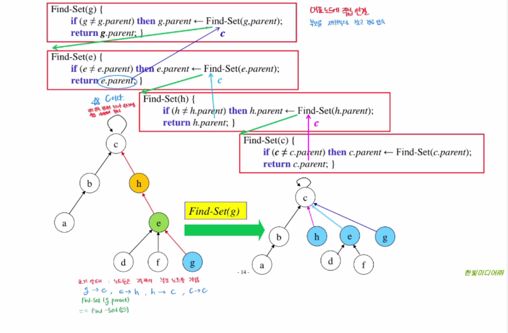
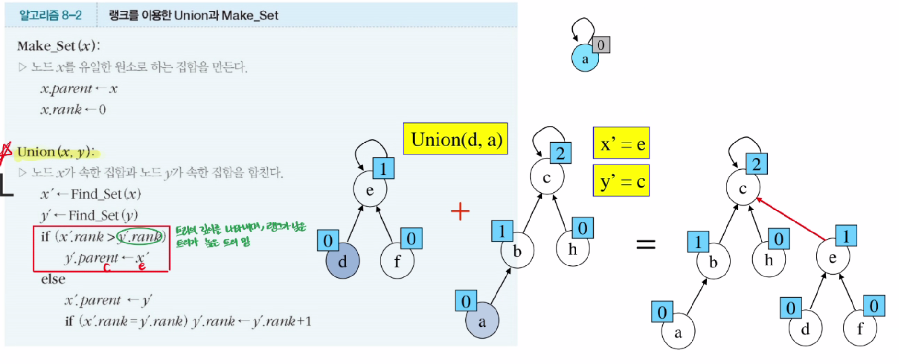
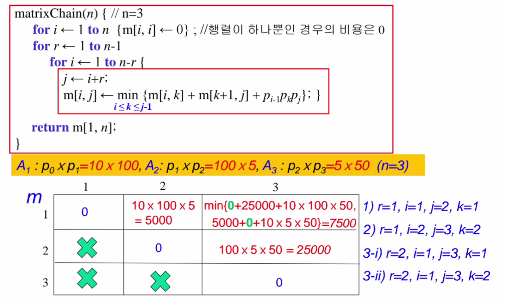
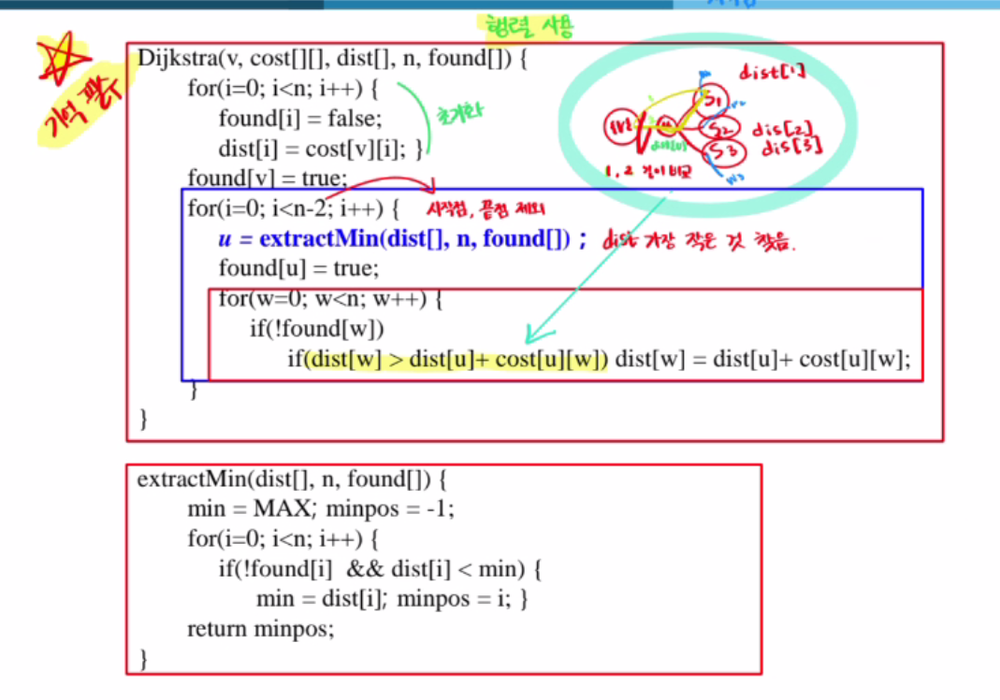

---
### 변수 설명

- **v**: 시작 정점(노드)의 번호입니다. 알고리즘은 이 정점에서 다른 모든 정점으로의 최단 경로를 찾습니다.
- **cost[][]**: 그래프의 인접 행렬을 나타냅니다. `cost[i][j]`는 정점 `i`에서 정점 `j`로 가는 비용(가중치)을 나타냅니다. 만약 두 정점이 연결되어 있지 않다면, `cost[i][j]`는 ∞(MAX)로 설정됩니다.
- **dist[]**: 시작 정점 `v`에서 각 정점까지의 최단 거리를 저장하는 배열입니다. 초기에는 `dist[v] = 0`, 나머지는 ∞로 설정됩니다.
- **n**: 그래프의 정점 개수입니다.
- **found[]**: 정점의 방문 여부를 나타내는 배열입니다. `found[i] = true`이면 정점 `i`는 최단 거리가 확정된 상태입니다.

---