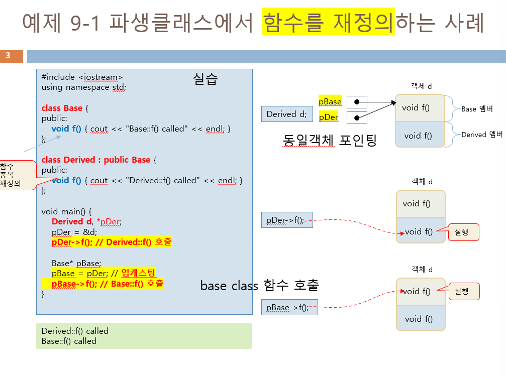
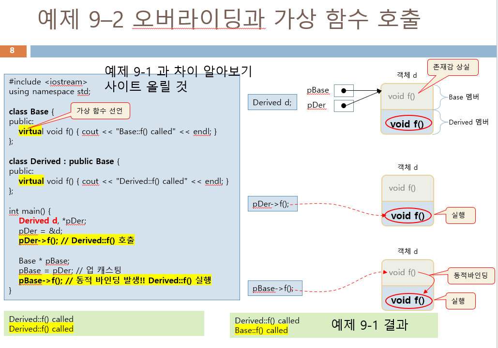
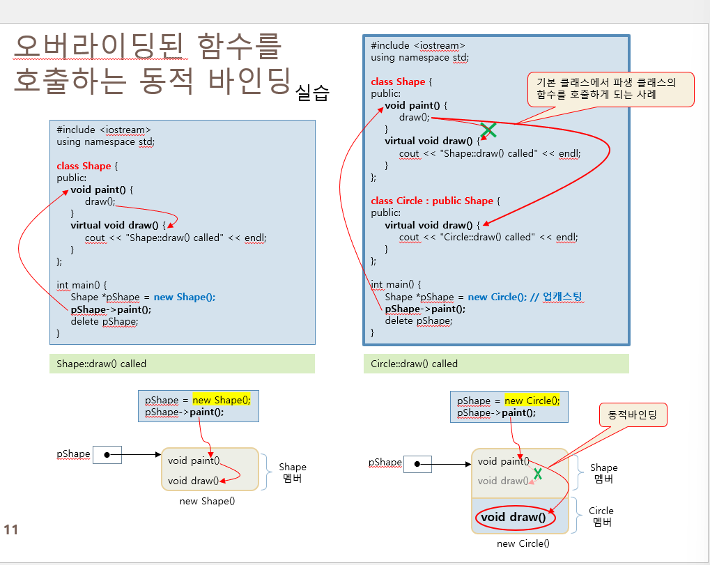

---
   
   ```cpp
   Base* pBase = pDer; // 업캐스팅
   pBase->f();         // Base::f() 호출
   ```
    - `pBase`는 `Derived` 객체를 가리키지만, 함수 호출 시점에 포인터 타입(`Base*`)에 따라 `Base::f()`가 호출됩니다.
    - **정적 바인딩**: 컴파일 시점에 호출될 함수가 결정됩니다.

3. **출력 결과**:
   ```
   Derived::f() called
   Base::f() called
   ```

---

### 예제 9-2: 오버라이딩과 가상 함수 호출
1. **특징**:
    - `Base` 클래스의 `f()`가 **가상 함수**로 선언됨(`virtual` 키워드 사용).
    - `Derived` 클래스에서 이를 오버라이딩(재정의)하여 동적 바인딩이 가능해집니다.
    - `Base*` 포인터를 통해 `Derived` 객체를 참조해도 **동적 바인딩**으로 인해 `Derived::f()`가 호출됩니다.

2. **코드 분석**:
   ```cpp
   Base* pBase = pDer; // 업캐스팅
   pBase->f();         // Derived::f() 호출
   ```
    - **동적 바인딩**: 런타임에 객체의 실제 타입(`Derived`)에 따라 호출될 함수가 결정됩니다.

3. **출력 결과**:
   ```
   Derived::f() called
   Derived::f() called
   ```

---

### 차이점 정리
| **구분**          | **예제 9-1**                                  | **예제 9-2**                                  |
|-------------------|----------------------------------------------|----------------------------------------------|
| 함수 선언         | 일반 함수                                    | 가상 함수 (`virtual`)                        |
| 함수 호출 방식    | 정적 바인딩 (컴파일 시점 결정)               | 동적 바인딩 (런타임 시점 결정)               |
| `Base*` 포인터 호출 | `Base::f()` 호출                           | `Derived::f()` 호출                          |
| 출력 결과         | `Derived::f()` <br> `Base::f()`              | `Derived::f()` <br> `Derived::f()`           |

가상 함수를 사용하면 객체의 실제 타입에 따라 적절한 함수가 호출되므로 다형성을 지원합니다.


---

---

위의 두 클래스 **Shape**와 **Circle**는 **가상 함수와 동적 바인딩**을 활용하여 서로 다른 동작을 보여줍니다. 주요 차이점을 정리하겠습니다.

---

### 공통점
- 두 클래스 모두 `paint()`라는 함수에서 `draw()`를 호출합니다.
- `draw()` 함수는 **가상 함수**로 선언되어 있습니다(`virtual` 키워드 사용).

---

### 차이점

| **구분**               | **Shape 클래스**                                         | **Circle 클래스**                                     |
|------------------------|--------------------------------------------------------|-----------------------------------------------------|
| **기능**              | `paint()`에서 `Shape` 클래스의 `draw()`를 호출합니다.   | `paint()`에서 `Circle` 클래스의 `draw()`를 호출합니다. |
| **함수 호출 방식**    | `draw()`가 **정적 바인딩**으로 호출됩니다.               | `draw()`가 **동적 바인딩**으로 호출됩니다.           |
| **가상 함수 동작**     | `Shape`의 `draw()`만 호출됩니다.                        | `Circle`의 `draw()`가 호출됩니다.                   |
| **출력 결과**         | `Shape::draw() called`                                  | `Circle::draw() called`                            |

---

### 동작 방식
1. **Shape 클래스**:
   - `Shape` 객체에서는 `paint()`가 호출되며, 내부적으로 `draw()`를 호출합니다.
   - 이때, `Shape` 클래스의 `draw()`만 호출되므로 정적 바인딩이 발생합니다.

2. **Circle 클래스**:
   - `Circle` 객체를 가리키는 `Shape*` 포인터를 사용해도, `draw()`는 **동적 바인딩**에 의해 `Circle` 클래스의 `draw()`가 호출됩니다.
   - 이는 런타임에 객체의 실제 타입(`Circle`)에 따라 함수가 선택되기 때문입니다.

---

### 예제 차이점의 시사점
- **Shape 클래스**는 가상 함수만 사용했을 때 정적 바인딩의 동작을 보여줍니다.
- **Circle 클래스**는 가상 함수와 동적 바인딩을 통해 다형성을 활용한 코드를 작성할 수 있음을 보여줍니다.

동적 바인딩을 활용하면 프로그램이 유연해지고, 상속 구조에서 적절한 함수 호출이 가능해져 유지보수성이 향상됩니다.